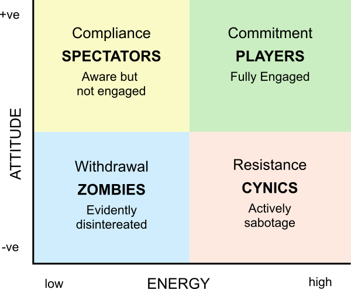

[Index](./README.md)

# Training

## Random notes

- Focus the drill on the task
- Start slow, lots of repetitions and then speed up
- Visualize in detail as much as you physically practice
- "Pretty training" means you aren't learning anything
- Contextual interference triggers long-term learning
- Coaches should coach: make the players feed and run the drills
- _Stop_ feeding a "free ball": use a "junk ball" where you throw a ball to a player and they have one shot to get the ball into play.  Their shot is then the real free ball, and the opposition players get to read a read shot (rather than learning the useless skill of how their coach feeds)
- Even at international level, rallies are out-of-system at least 50% of the time, so your training should practice this
- Players looking at the coach is a sign that they're used to being told off, or don't think they have authority to take control
- Coaches get better results by giving solutions to problems or targets the players can attain
- Have a clear and obvious target that's highly visible to the players.  Write it on the wall where you train if necessary
- Measure effectiveness with some score or stats
  - How do you know if you're improving if you don't measure it?
  - Be wary that you count the right stats and you're not causing focus on the wrong thing (score serves in court and you'll make a team of safe servers)
  - The objective is vital in defining the measurement, e.g. "**improve** the **quality** of the **pass**" leads to a drill focusing on passing that measures the utility resulting from the pass and shows an improvement across the drill
  - Subjective measurement is best done by a single person (e.g. passing quality), objective measurement is impartial (e.g. setter's options from a pass)
  - A lack of granularity can cause a lack of demonstrable effect
- Training should end with feedback and reflections, which can continue after you leave the sports hall

## Reading the Game

"Reading" is one of the most important skills.  If a player can't read the game then they won't play, they will only panic and react.  

## Energy Investment Model

## Motor Learning

Motor learning is the science of how we acquire skill and maximise skill-transfer through practice.  That is, learning skills that are still evident a week later.  

### Random v Blocked Training:

- Random Training: Different movements and skills in mixed orders
- Blocked Training: Repetitive skill drills

Several studies show that random training leads to more learning and skill-retention.  It forced the player out of auto-pilot, ensuring that they "read, plan, do" for every action in a drill.  It's "uglier" as the contextual interference is higher to start with, but in the long term it produces better players

### Game-like Environment

Make training as "real" as possible; the game teaches the game.

- Is the net the right height
- Have antennae
- An attack should have a block
- Where possible, there should be a score

Ask yourself, "does this look like volleyball?"  Where does the ball come from?  Where does the ball go?  What are the players watching and where are they moving?  What decisions do they make?

## Coaching Juniors

- The coach's role is important; they are the trusted role model
- Consider their confidence; grow it as much as skills.  Do this by making sure they succeed at some tasks
- They want to play games, so lots of game-style drills
- Let them take control and own their own development
- When they get squirmy, wear them out, get them to hit against the wall
- Let them explore the process/game so they can turn failure into learning
- Understand them as individuals; sometimes they're having a bad day, so create a supportive environment and they'll thrive
- Make sure the sport is competitive
