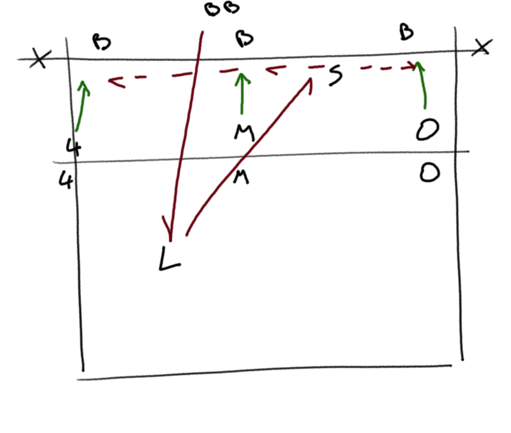
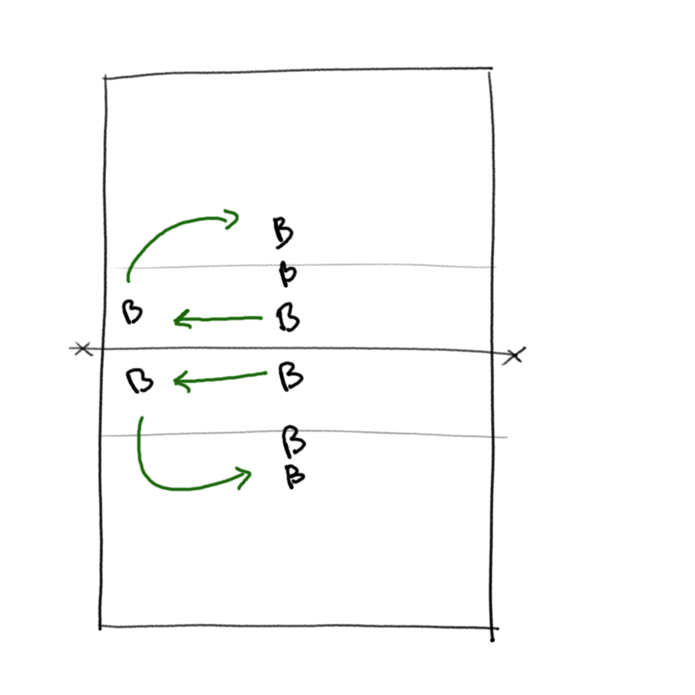
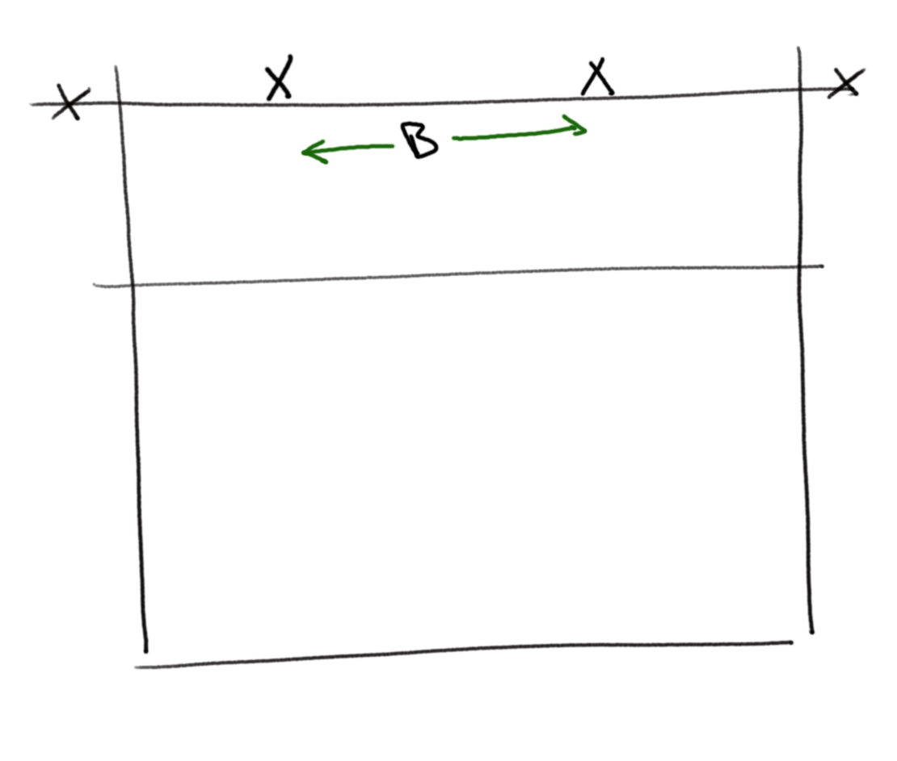
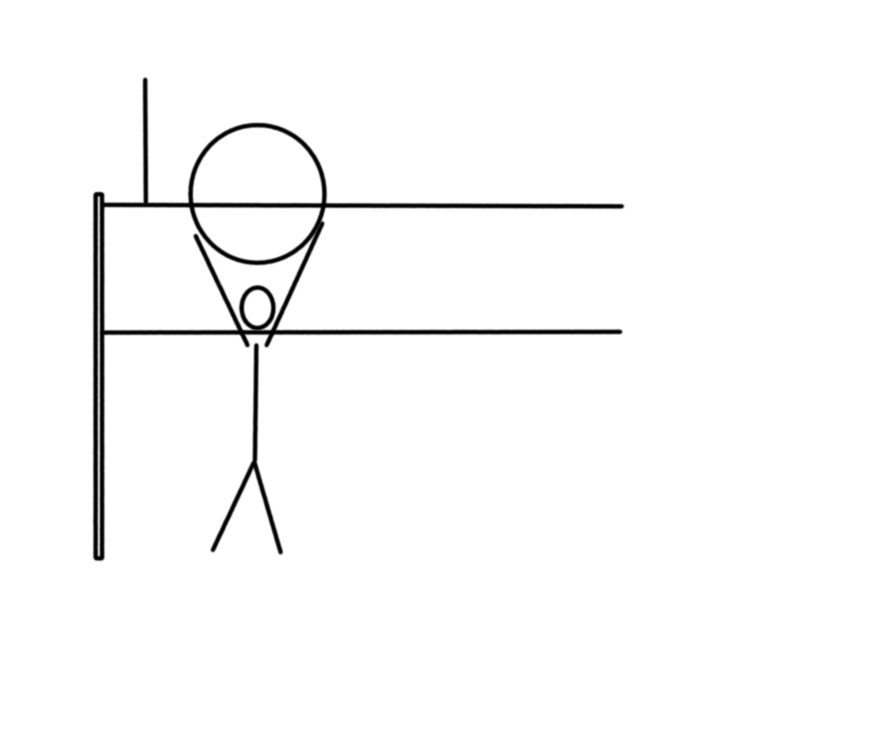
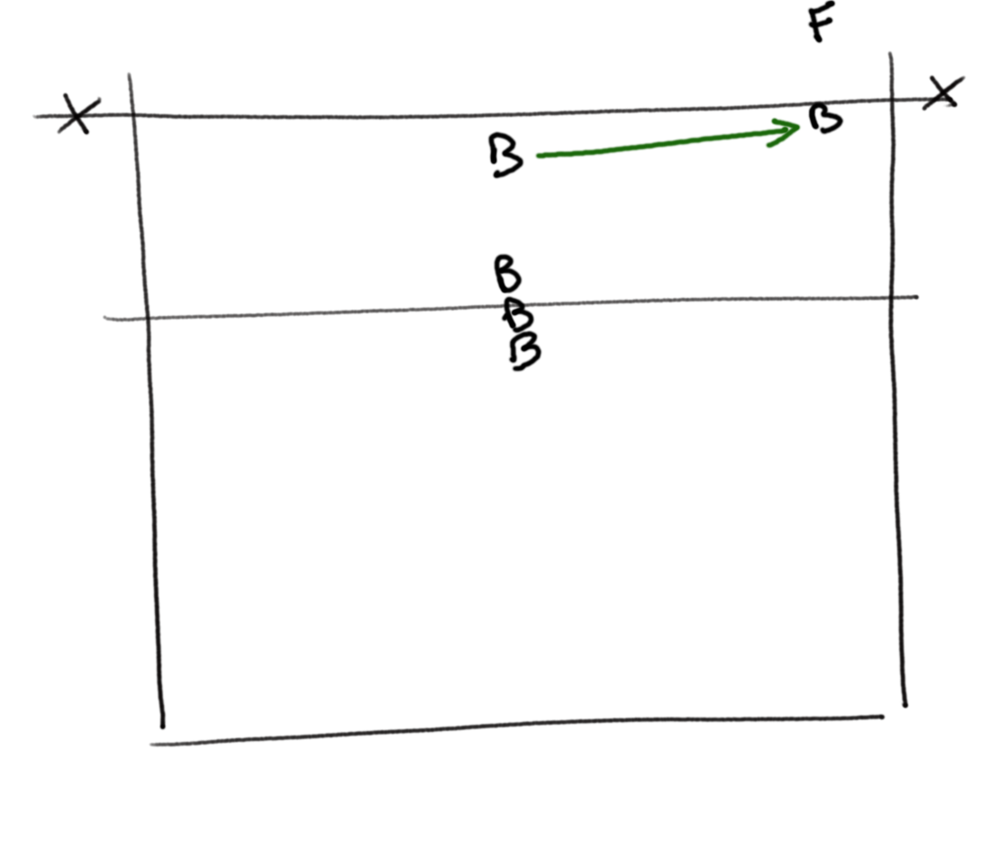
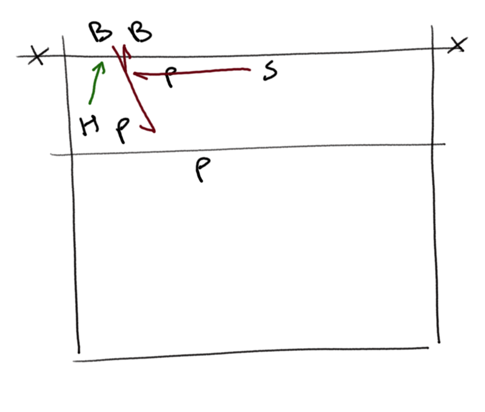

[Index](../../README.md) > [Drills](./../Drills.md)

# Blocking Drills

### Block Attack

`movement, defence`

<ul style="margin-left: 300px">
  <li>Blockers on one side with multiple middle blockers queued up</li>
  <li>Someone from the queue feeds ball to the libero to pass to the setter.</li>
  <li>The setter sets a hitter who attacks and blockers have to put up a 2 person block</li>
</ul>

 

---

### Block Chain

`movement, technique`

<ul style="margin-left: 300px">
  <li>Set up pairs of lines each side of the net</li>
  <li>One pair start near antenna as the outside blockers</li>
  <li>Middle pair go together with 3 step movement to the wing and all 4 blockers jump together</li>
  <li>The middle pair become the outer markers and the markers join the back of the queue</li>
</ul>

 

---

### Block Killer

`movement, discipline under exhaustion`

<ul style="margin-left: 300px">
  <li>Hitters on platforms feed an attack ball into a block</li>
  <li>The blocker goes back and forth between the feeders, blocking until they are exhausted
    <ul>
      <li>Caution that loose balls are clear of the blocker</li>
    </ul>
  </li>
</ul>

 

---

### Hoop Penetration

`technique, invasion of space`

<ul style="margin-left: 300px">
  <li>Someone holds a gym hoop above the net, parallel to the plane of the net</li>
  <li>The blocker performs a swing block and has to penetrate through the net, trying to invade the hitter's space</li>
</ul>

 

---

### Middle Man 4

`movement, position`

<ul style="margin-left: 300px">
  <li>The blocker starts at 3</li>
  <li>A feeder slaps the ball and the blocker swing blocks out to block a 4-hit</li>
  <li>The feeder feeds a flat ball and the blocker blocks
    <ul>
      <li>Note that a low net helps with feed variability as a feeder off the net tends to go high to avoid the block; the player still has to jump high to reach the ball even if the net is low</li>
    </ul>
  </li>
</ul>

 

---

### Pachinko

_Paul Westhead, level 2 coaching course_

`defence, team`

<ul style="margin-left: 300px">
  <li>Feed a ball into the passers, who pass to the setter</li>
  <li>The setter sets to the 4 hitter, who hits into a 2-person block
    <ul>
      <li>If the block is too weak, replace with a board</li>
    </ul>
  </li>
  <li>The passers and hitter have to recycle the ball to the setter, who sets to the 4 hitter again</li>
  <li>The team continue to recycle off the block until the ball is dead, then they start again off a feed to the passers</li>
</ul>

 

---
