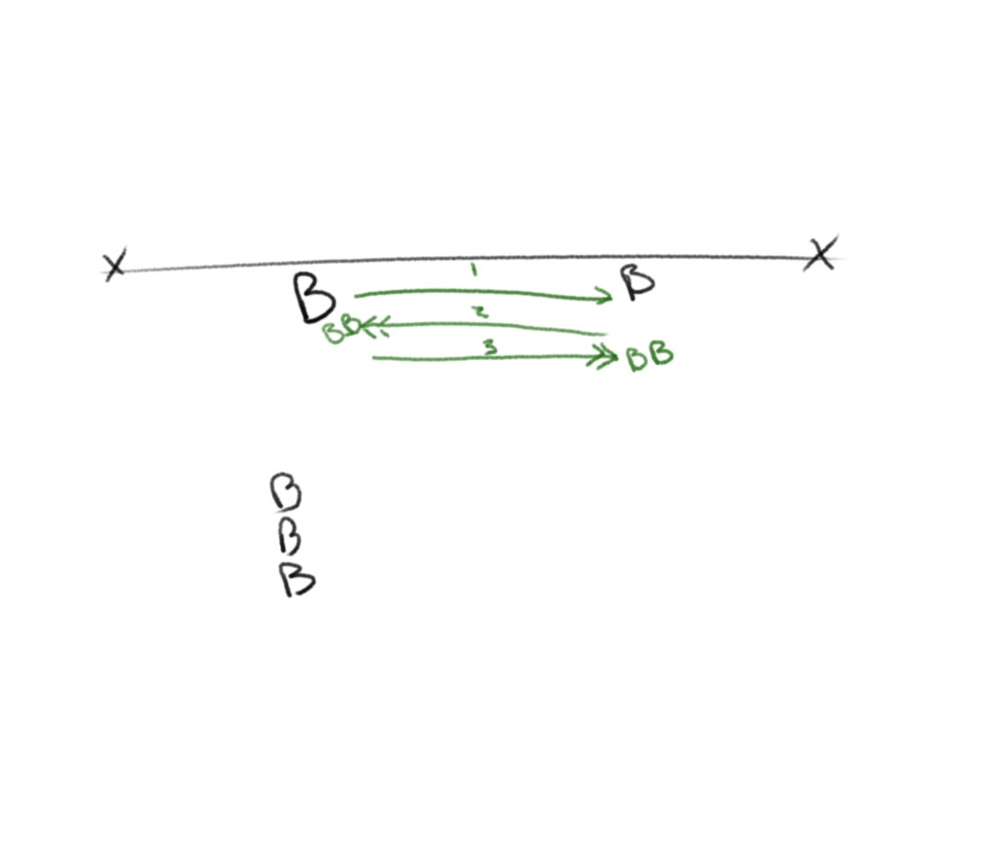
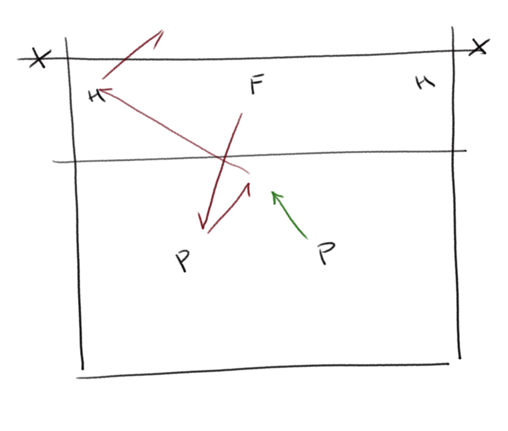
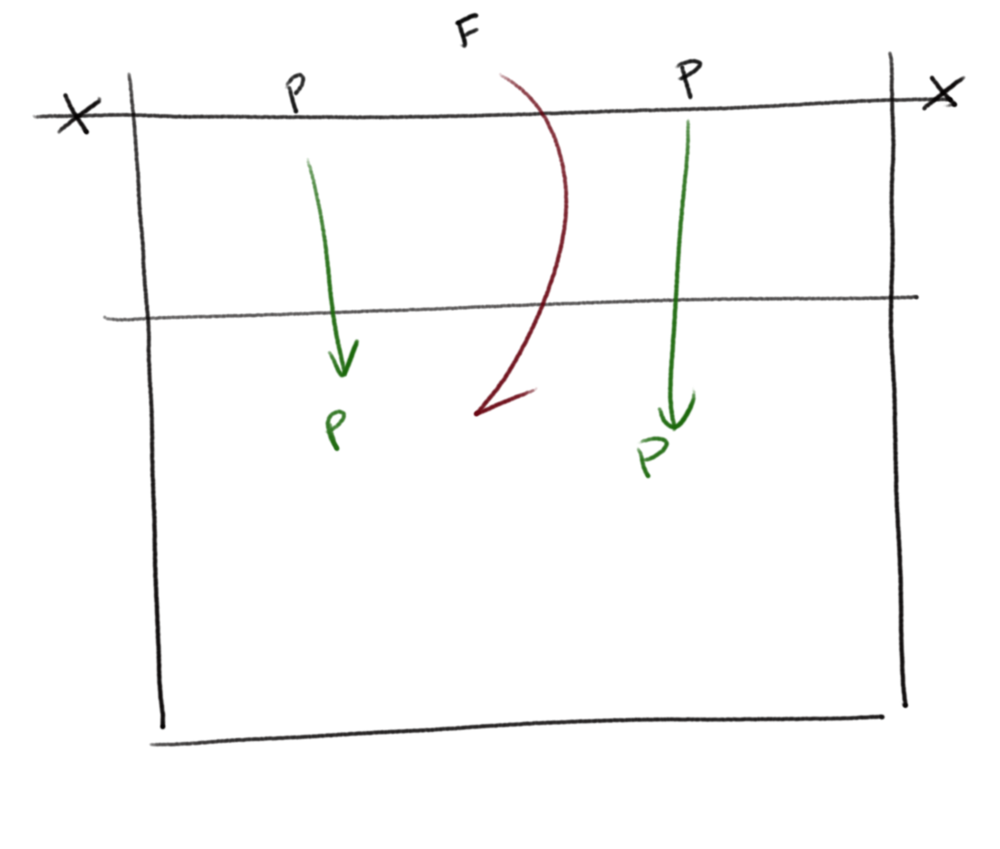
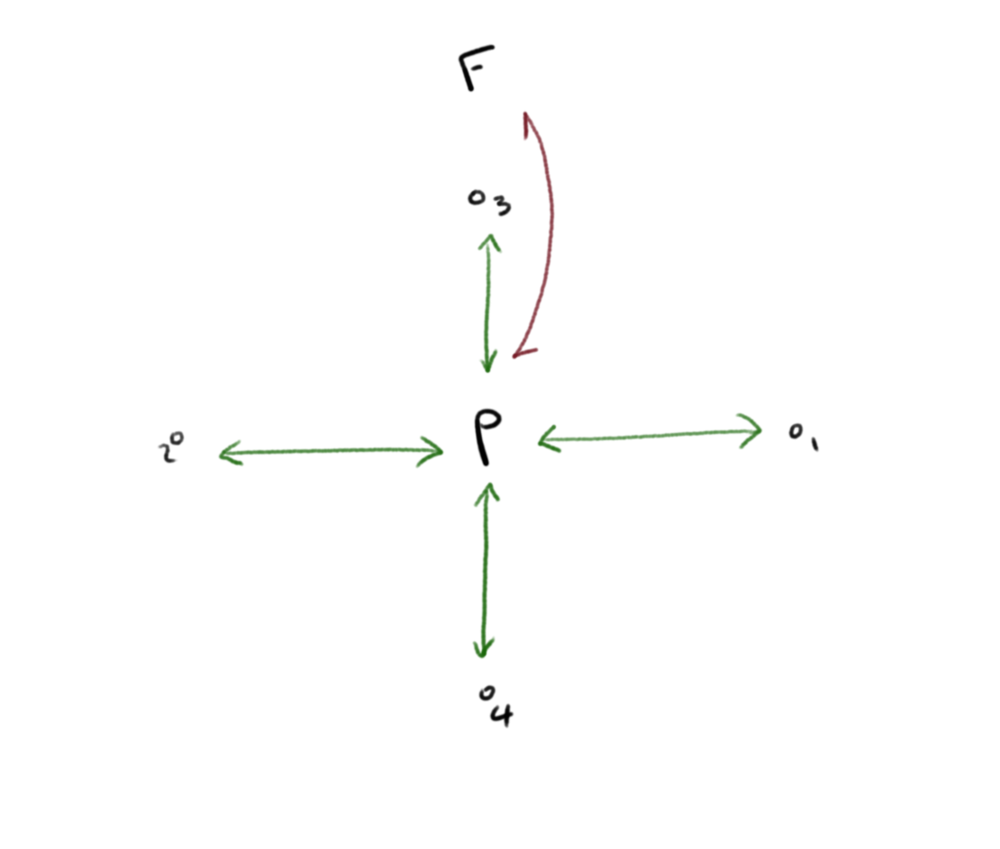
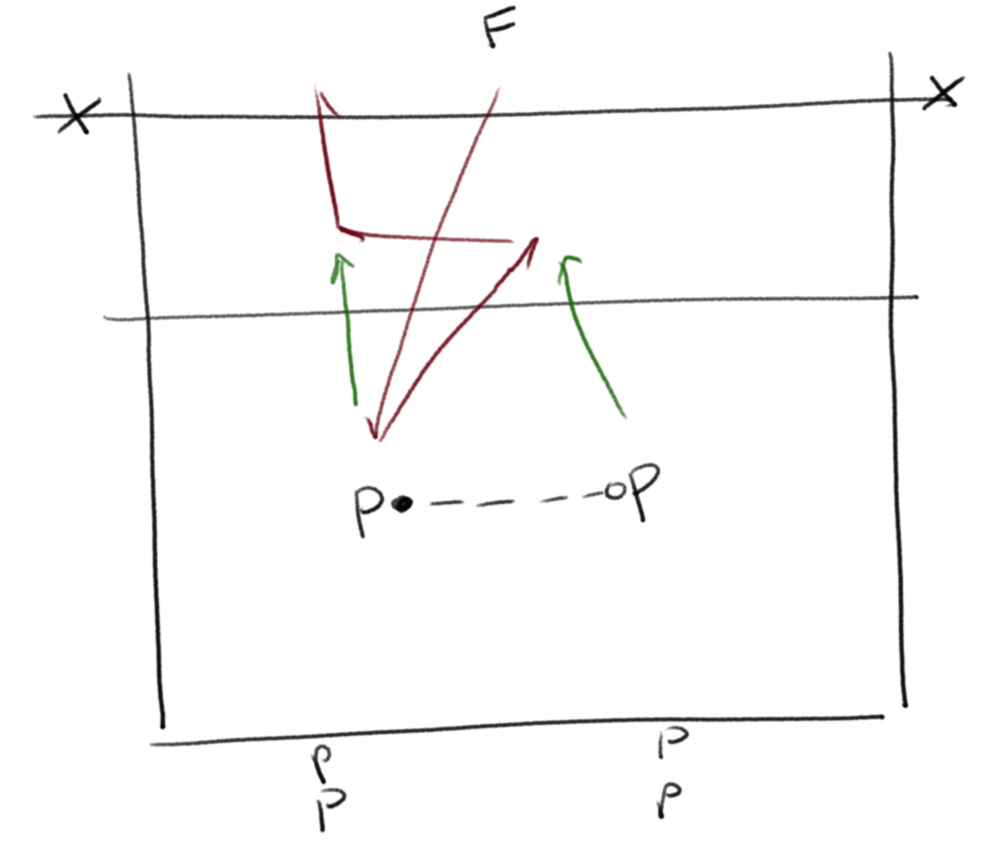
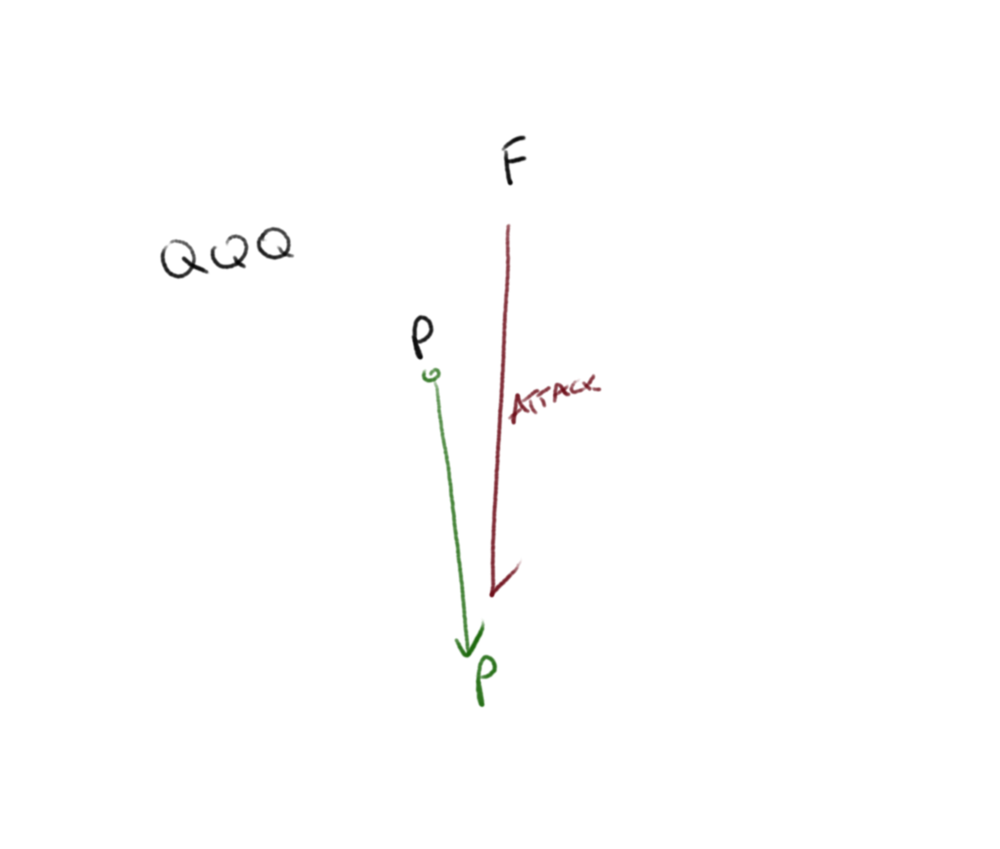
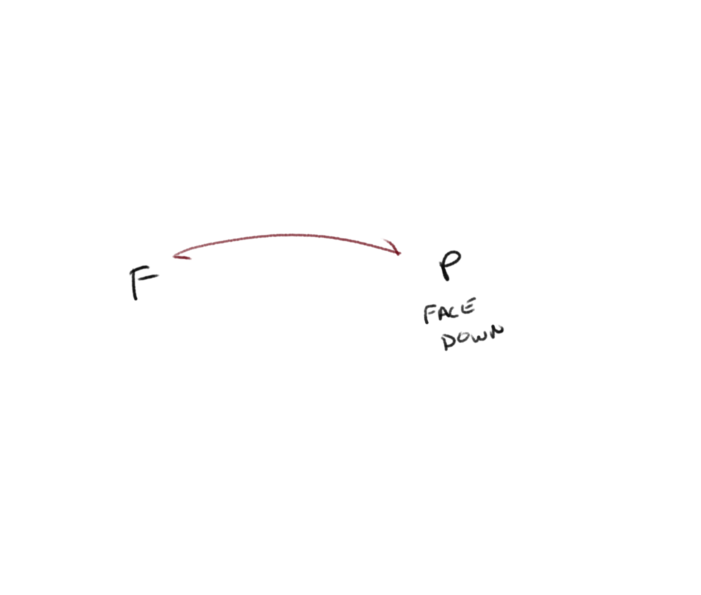
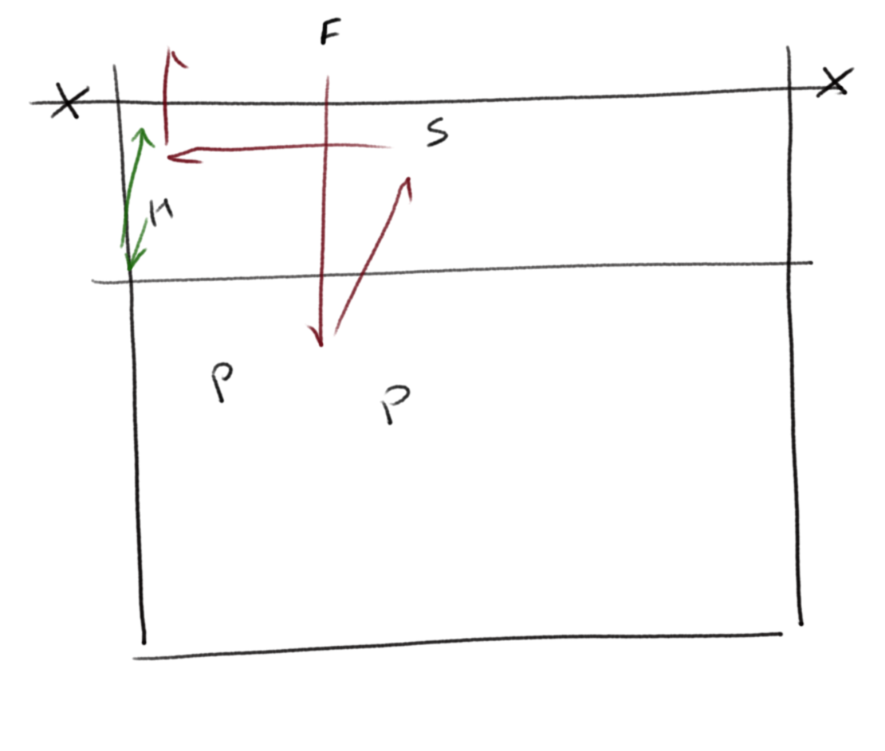
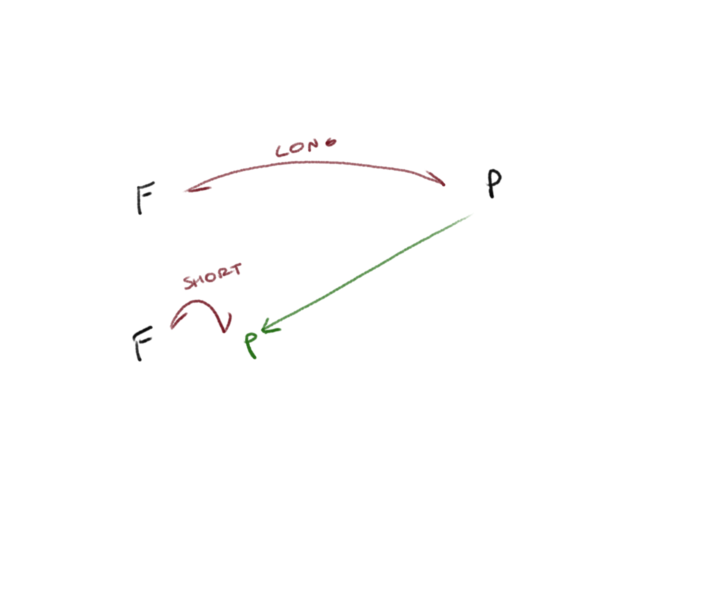
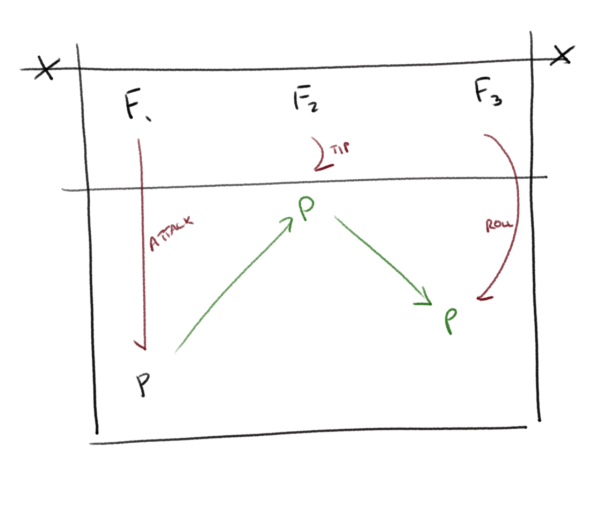

[Index](../../README.md) > [Drills](./../Drills.md)

# Circuits Drills
### Block-Movement

_Tim Nash, Southampton VC Training_

`block movement`

<ul style="margin-left: 300px">
  <li>Start with two blockers apart</li>
  <li>The left blocker transitions right to the right blocker, both blockers jump</li>
  <li>Both blockers transition left and block</li>
  <li>Both blockers transition right and block</li>
  <li>The left blocker replaces the right blocker, and the right blocker peels off and joins the back of the queue</li>
</ul>

 

---

### Bump-Setting

`out-of-system`

<ul style="margin-left: 300px">
  <li>A feeder feeds some sort of ball to 2 passers</li>
  <li>The passer passes to the centre of court and their partner comes in and sets to the cross-court wing</li>
  <li>The hitter rolls a shot across court</li>
  <li>The passers replace the hitters</li>
  <li>Check that the players adapt to the ball they are playing: this is out of system, so the players should maximize chance of success and putting pressure on the opposition, not the high risk balls</li>
</ul>

 

---

### Chase-And-Build

`teamwork`

<ul style="margin-left: 300px">
  <li>The feeder slaps the ball and a pair of players run under the net to get the ball</li>
  <li>The pair get three touches to build an attack</li>
  <li>Check that they maintain discipline on the attack and they work for their team-mates</li>
</ul>

 

---

### Cross-Move-And-Pass

`balanced movement`

<ul style="margin-left: 300px">
  <li>Place four cones in a cross, with a passer in the middle</li>
  <li>The passer has to move to each cone and back to the centre in turn, staying low at all times</li>
  <li>When the passer returns to the middle a feeder feeds them a ball to pass</li>
  <li>Are they balanced in all four directions</li>
</ul>

 

Adaptations can involve having the cones in a diagonal cross

---

### Double Ball

_Bertrand Olie - Volleyball England article [https://www.volleyballengland.org/news/article/5503/the-coaching-corner](https://www.volleyballengland.org/news/article/5503/the-coaching-corner)_

`thinking`

<ul style="margin-left: 300px">
  <li>The pair have a ball that one of the pair is holding</li>
  <li>F feeds a ball and the pair have 3 touches to build an attack</li>
  <li>The players have to throw the "holding" ball between them before they can play the ball in flight</li>
  <li>How much do they prepare for their next job</li>
</ul>

 

---

### Drop-Back-And-Pass

`Saffi Mant, Solent training`

<ul style="margin-left: 300px">
  <li>The feeder slaps a ball and the player has to back track fast</li>
  <li>The feeder then plays an attack ball, and the passer has to stop and be on their toes at the point the feeder contacts the ball</li>
  <li>The passer has to pass back tot he feeder</li>
</ul>

 

---

### Get-Up-Pass

`work, discipline of technique`

<ul style="margin-left: 300px">
  <li>The passer starts face-down on the floor</li>
  <li>The feeder slaps the ball, the passer gets up, the feeder feeds and the passer passes back</li>
</ul>

 

---

### Golden Player

_Bertrand Olie - Volleyball England article [https://www.volleyballengland.org/news/article/5503/the-coaching-corner](https://www.volleyballengland.org/news/article/5503/the-coaching-corner)_

`pressue`

<ul>
  <li>Play a simple match of 3v3 or 4v4</li>
  <li>1 player gets +5 points for a point/kill: do they think about how to maximise points, both as a team and as the golden player?</li>
  <li>Next, the "golden player" gets +5 for a kill and -3 for an error: do they adjust the risk of their attack?</li>
</ul>

### Hitter-Resilience

`pressure, handling failure`

<ul style="margin-left: 300px">
  <li>Feed an easy ball into the passers, who pass to a setter, who sets to the 4 hitter</li>
  <li>The 4 hitter has to hit 5 clean hits in a row.  The ball has to clear the net and be in.  If they don't get 5 clean hits then their count resets to zero and they start again</li>
  <li>The focus is on how the hitter, and the team, handles failure: do they fold inwards, do they get on with it, do they over-compensate...</li>
</ul>

 

---

### Long-Short-Pass

`movement, technique`

<ul style="margin-left: 300px">
  <li>The long-feeder feeds a flat ball at the passer, and the passer passes back</li>
  <li>The tip-feeder feeds a tip ball and the passer has to rush in and pass</li>
  <li>The tip ball should force the passer to dive</li>
</ul>

 

---

### Passing-Energy

`passing energy`

<ul style="margin-left: 300px">
  <li>The passers face a simple chain of 3 kinds of pass:
    <ul style="margin-bottom: 0px;">
      <li>Attack ball: stay low and wide, and intercept the ball in front</li>
      <li>Tip ball: get low and under the ball and use your legs to lift it high for the setter</li>
      <li>Roll-chase: get behind the ball and pull back to the target</li>
    </ul>
  </li>
  <li>See if they can play all three energies of ball and whether they adapt their technique as needed</li>
</ul>

 

---
