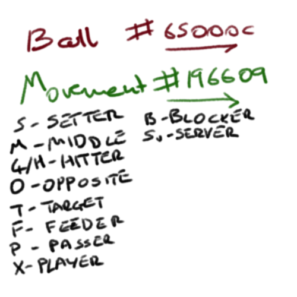

[Index](../README.md)

# Drills

- [Blocking](./BlockingDrills/BlockingDrills.md)
- [Circuits](./CircuitsDrills/CircuitsDrills.md)
- [Hitting](./HittingDrills/HittingDrills.md)
- [Passing](./PassingDrills/PassingDrills.md)
- [Rally](./RallyDrills/RallyDrills.md)
- [Serve Receive](./ServeReceiveDrills/ServeReceiveDrills.md)
- [Service](./ServiceDrills/ServiceDrills.md)
- [Setter Drills](./SetterDrills/SetterDrills.md)
- [Warmup Drills](./WarmupDrills/WarmupDrills.md)

## Image key

