[Index](../../README.md) > [Drills](./../Drills.md)

# Hitting Drills

### Quick-Middle-Cross

`setter-middle`

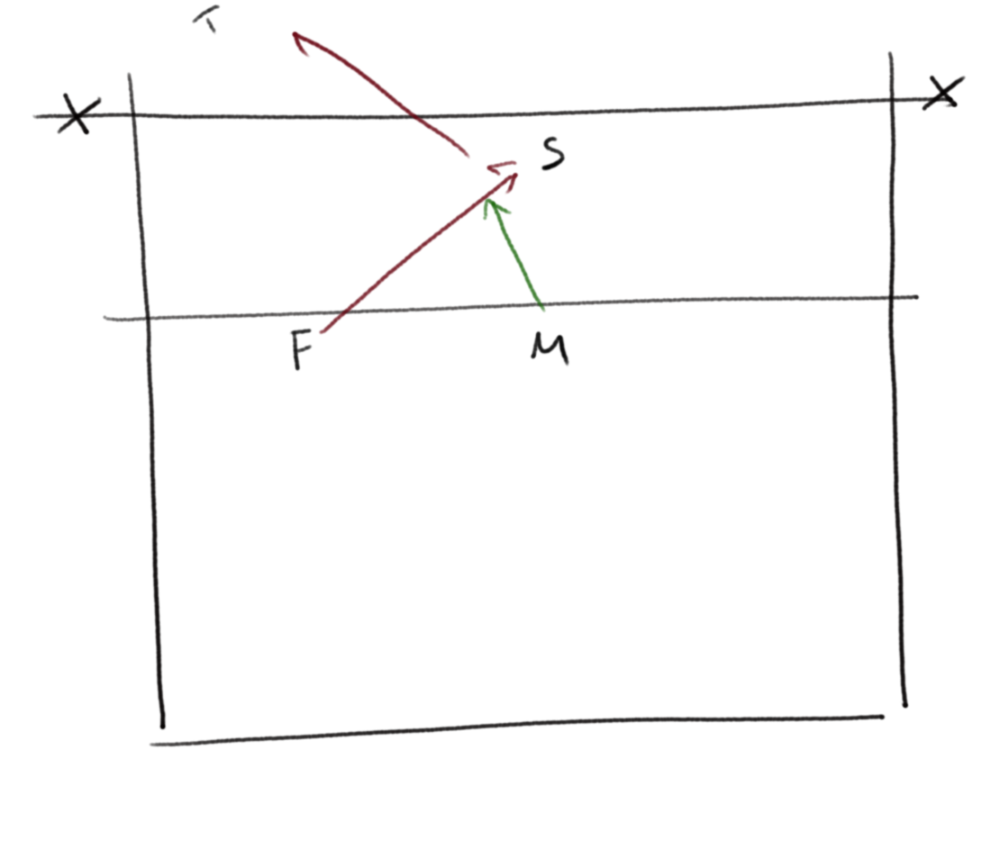

<ul style="margin-left: 300px">
  <li>Feed from the left of the hitter</li>
  <li>The middle has to watch the ball without being able to see the setter at first, and hit a quick attack</li>
</ul>

 

Adaptations can involve playing off a pass a pass and putting up a block to beat.

---

### Quick-Middle-Open

`setter-middle`

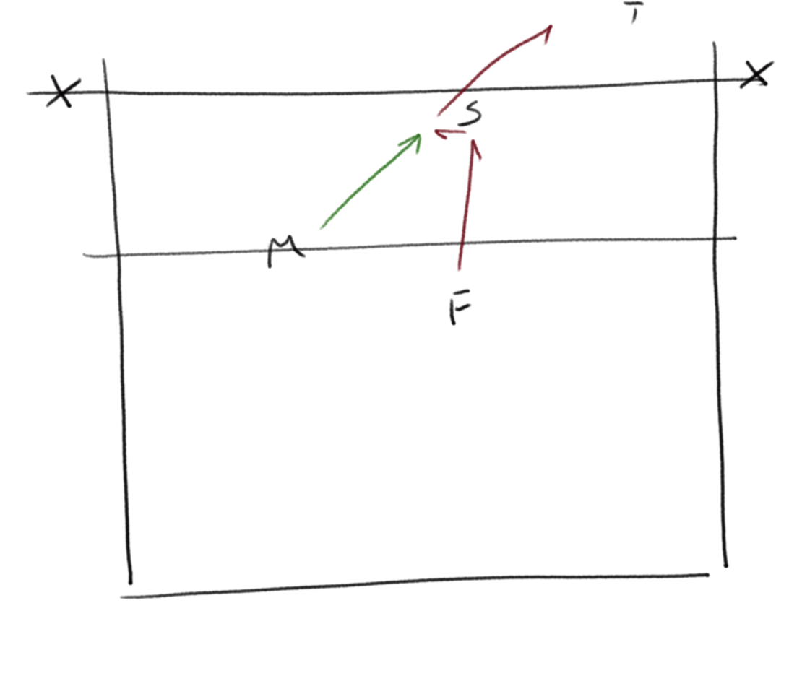

<ul style="margin-left: 300px">
  <li>Feed from the right of the hitter</li>
  <li>The middle has to hit a quick attack</li>
</ul>

 

Adaptations can involve playing off a pass and putting up a block to beat.

---

### Standard-Hitting-Drill

`line hitting`

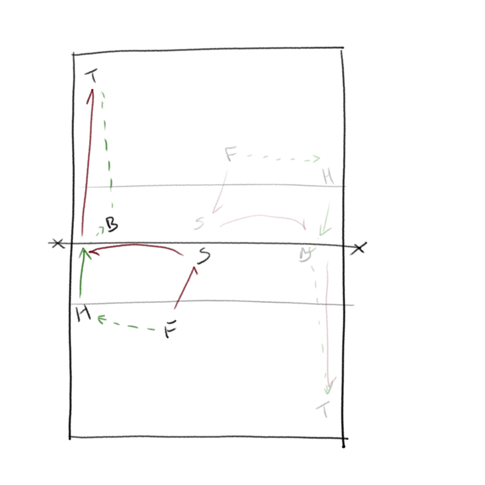

<ul style="margin-left: 300px">
  <li>Have someone other than the hitter feed the hitter's ball</li>
  <li>Hit a line ball through 4, with a block blocking cross court to a target passer at 1</li>
  <li>Everyone (except the setter) then moves on one position</li>
  <li>This can be run on both sides of the net and run as a chain</li>
</ul>

 

---

### Piston

`piston attack`

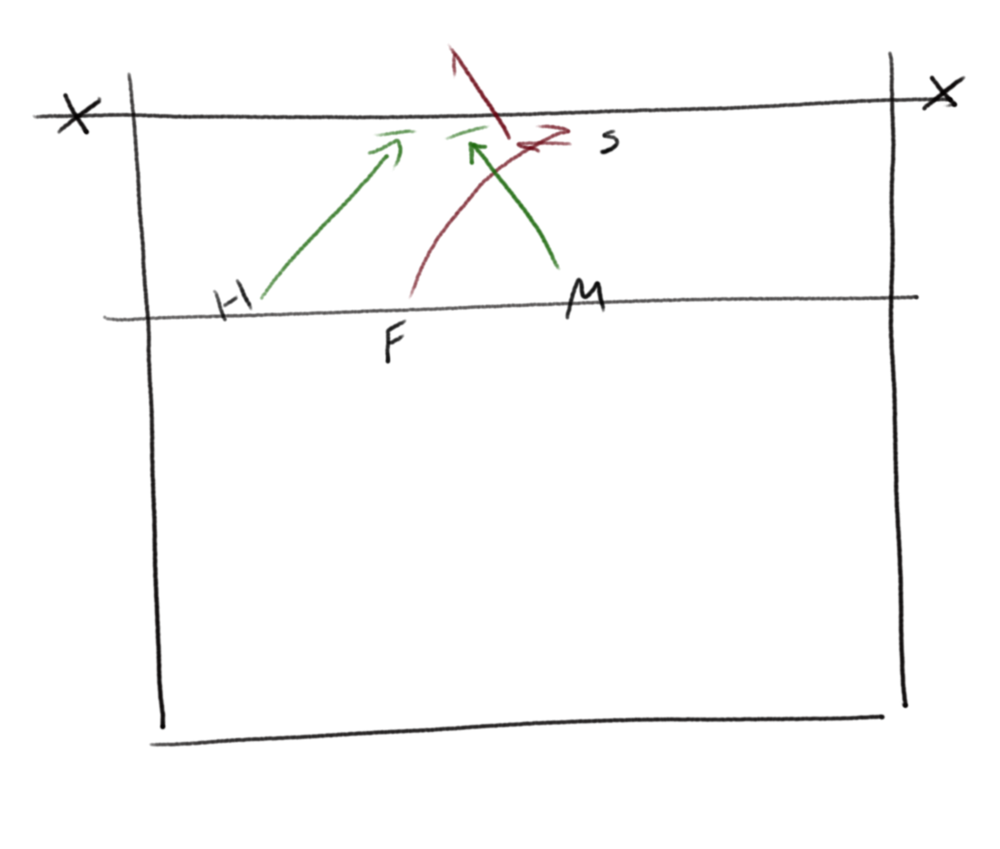

<ul style="margin-left: 300px">
  <li>The feeder (which can be from the next pair to go) feeds from between the 4 hitter and the middle</li>
  <li>The hitters run a piston attack and the setter can choose either to set to</li>
  <li>The 4 hitter tries to maintain the deception of the attack</li>
  <li>Try to keep the pairs together so they can work together</li>
</ul>

 

Adaptations can involve adding a block to beat.

---

### Pass-And-Hit

`passing, rhythm`

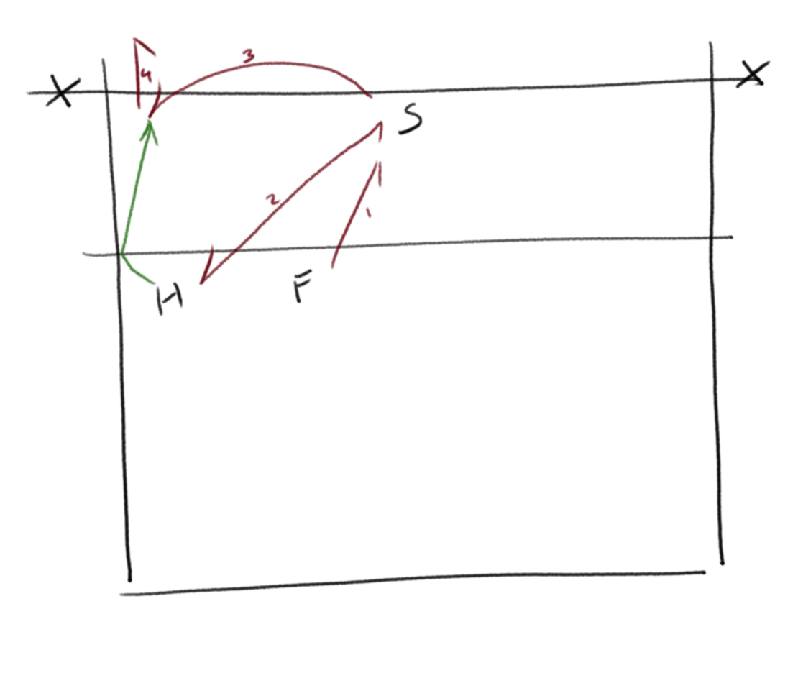

<ul style="margin-left: 300px">
  <li>The ball is fed to the setter, who hits a ball at the 4 hitter</li>
  <li>The 4 hitter passes then transitions to their hit</li>
  <li>The setter sets the hitter and they hit</li>
</ul>

 

---

### 4-Transition

`transitions`

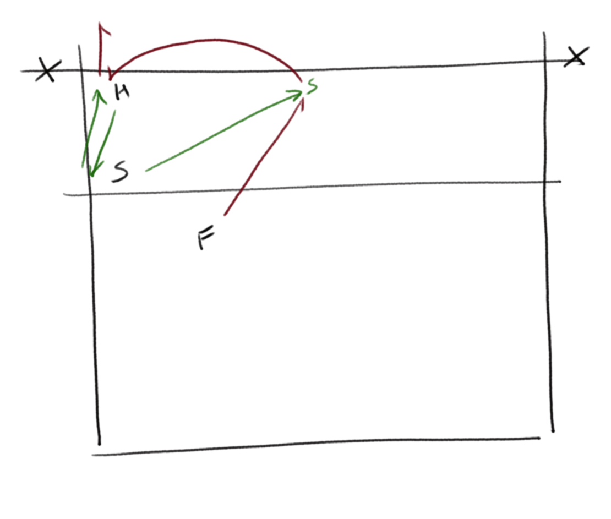

<ul style="margin-left: 300px">
  <li>The 4 hitter starts at the net, and the setter at 6 or 5</li>
  <li>The feeder slaps the ball, then the setter moves to 2 1/2 and the hitter backs off the net</li>
  <li>The feeder feeds the setter, who sets to the 4 hitter</li>
</ul>

 

---

### Middle-Transition

`transitions, work`

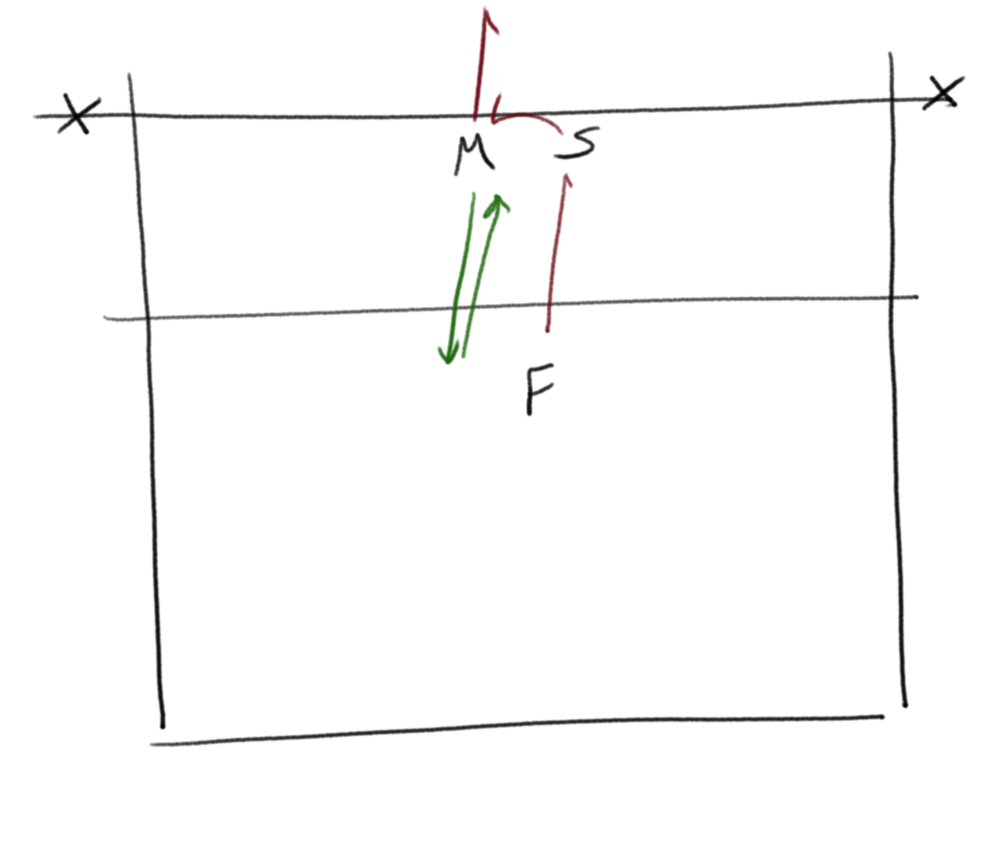

<ul style="margin-left: 300px">
  <li>The feeder slaps the ball and the setter and middle both block</li>
  <li>The feeder feeds the ball, the setter turns to track the ball and the middle backs off the net</li>
  <li>The setter sets the middle for a quick attack</li>
  <li>The pair then repeat until exhausted</li>
</ul>

 

---

### Late-Tip

`attack adaptation`

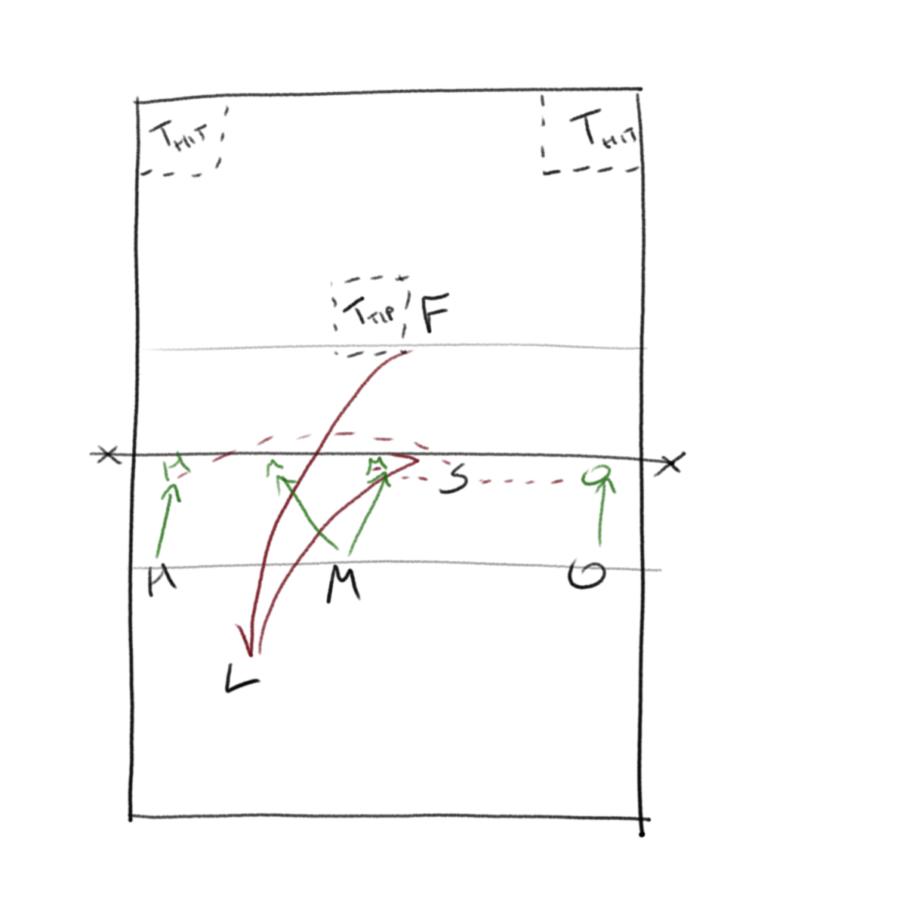

<ul style="margin-left: 300px">
  <li>The feeder feeds a ball to the libero, who passes to the setter and the team run 3 hitting lanes</li>
  <li>The hitters should hit the corner targets on a hit and the trolley/target on a tip</li>
  <li>The coach calls what they attackers have to do</li>
  <li>The coach can try calling later and later, up to the point of calling after the hitter jumps</li>
</ul>

 

---

### Middle-Block-Hit

`block and hit, work`

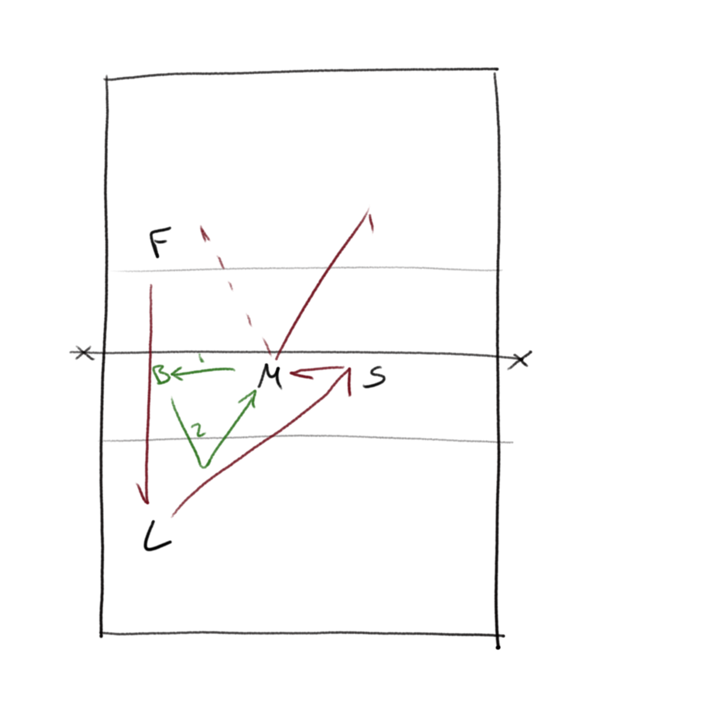

<ul style="margin-left: 300px">
  <li>The feeder slaps the ball, then feeds the ball to the libero</li>
  <li>The middle blocker swing blocks out to 4</li>
  <li>If the ball beats the blocker, the libero passes to the setter</li>
  <li>The middle has to land and get off the net so that they can run a quick attack</li>
</ul>

 

---

### Middle-4-Stack

`rotation, middle`

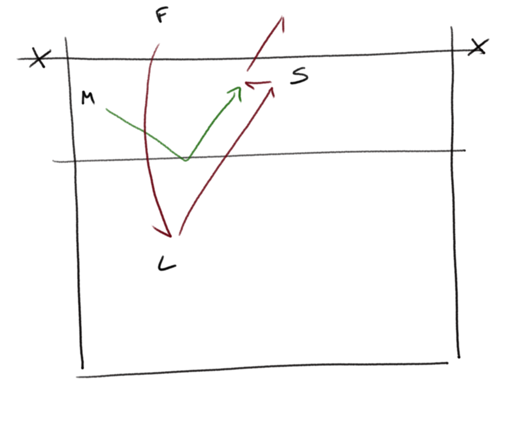

<ul style="margin-left: 300px">
  <li>The feeder feeds a ball to the libero at 5</li>
  <li>The middle has to transition from 4 and run a quick attack</li>
  <li>The players then reset and go again</li>
</ul>

 

---

### Middle-2-Stack

`rotation, middle`

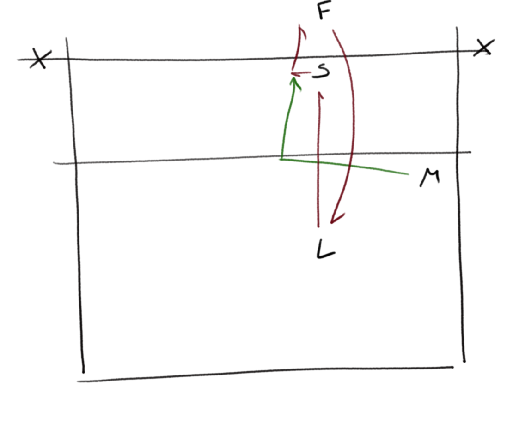

<ul style="margin-left: 300px">
  <li>The feeder feeds a ball to the libero at 1</li>
  <li>The middle has to transition from 2 and run a quick attack</li>
  <li>The players then reset and go again</li>
</ul>

 

---

### Back-Court-Lanes

`back-court-attacks`

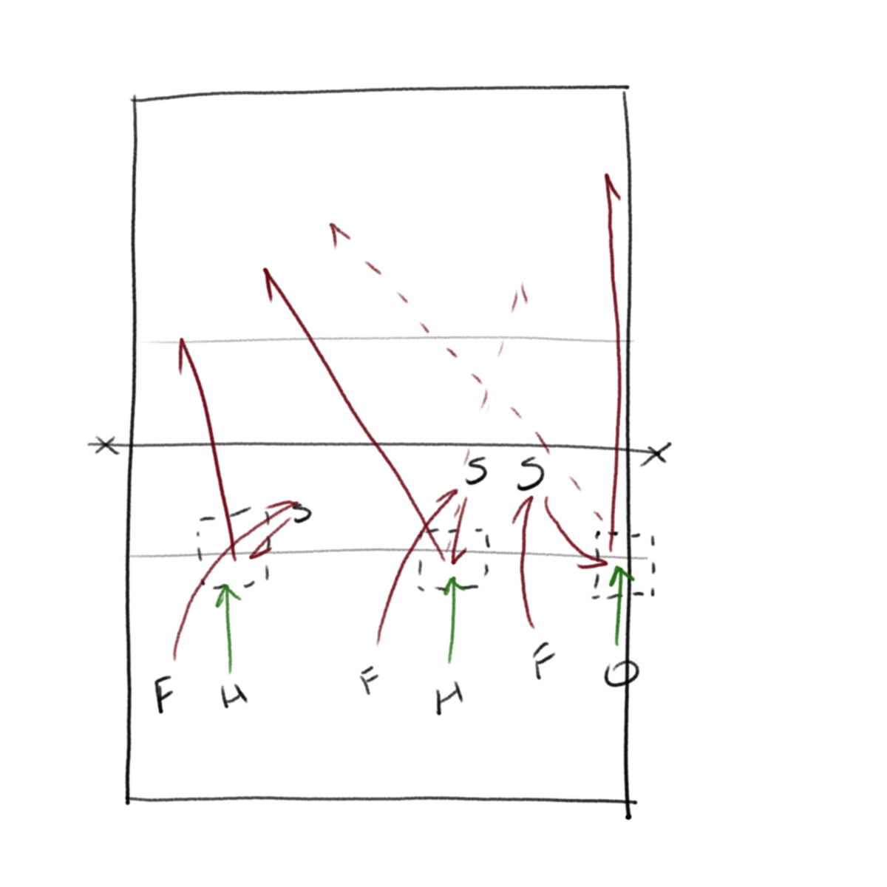

<ul style="margin-left: 300px">
  <li>Run any of 3 possible lanes
    <ul>
      <li>10 ball on the side line</li>
      <li>Pipe attack from between 1 and 6</li>
      <li>Pipe attack from between 5 and 6</li>
    </ul>
  </li>
  <li>Have a separate feeding queue for each lane</li>
  <li>This requires accurate setters, and mustn't have a block (too many balls floating around)</li>
</ul>

 

---

### 4-Pair-Pass-And-Hit

`pass as a unit`

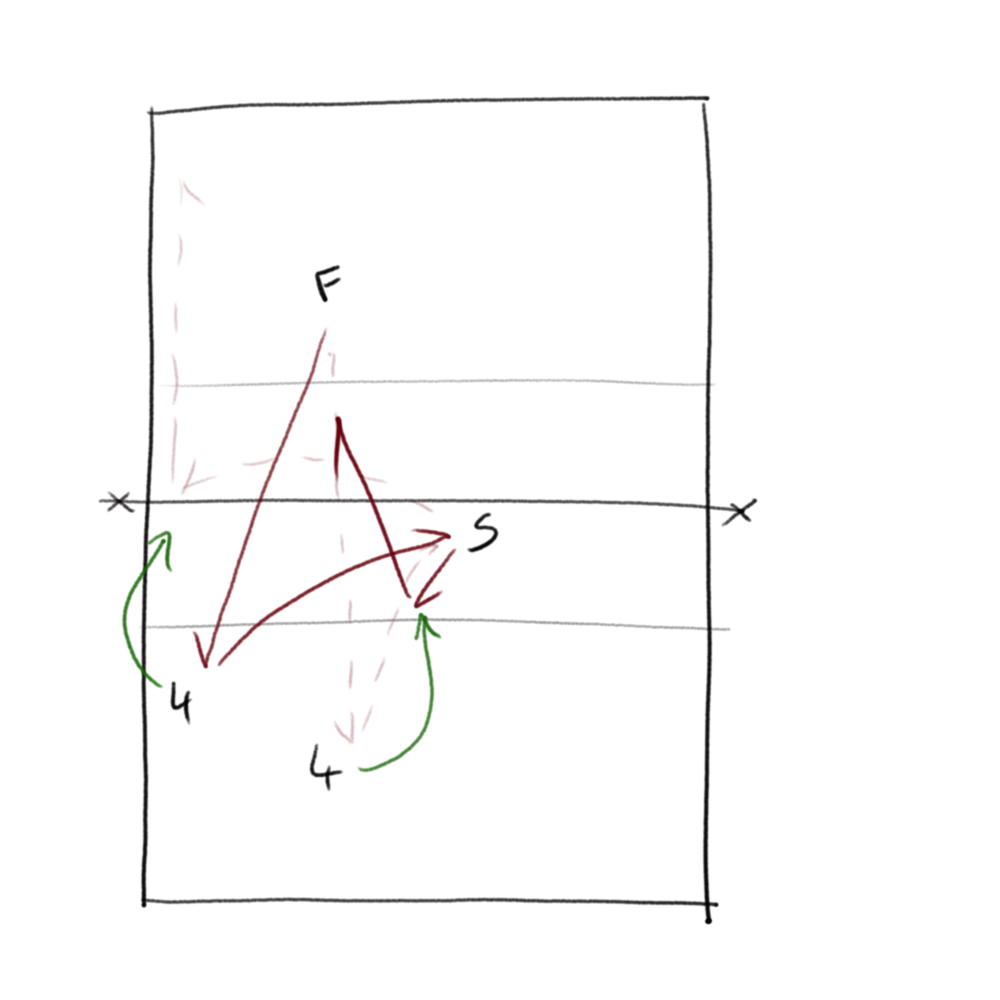

<ul style="margin-left: 300px">
  <li>Have passers at 5 and at 6 and feed a ball for them to pass to the setter</li>
  <li>The player at 5 then transitions to hit thorugh 4 and the player at 6 runs a pipe attack</li>
  <li>The setter can set to the non-passer or to the passer, whichever the coach wants to work on</li>
</ul>

 

---

### Controlled-Targets

`attack control`

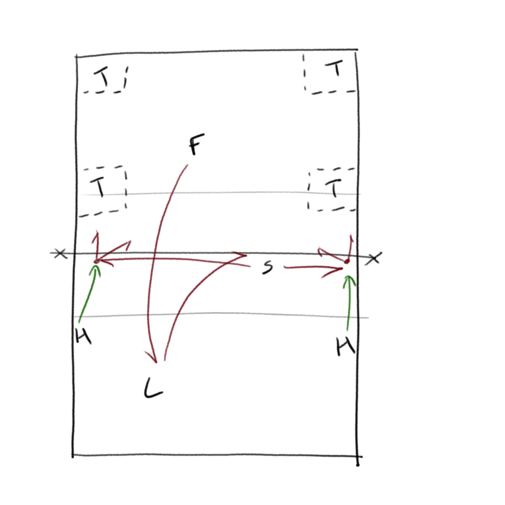

<ul style="margin-left: 300px">
  <li>The ball is fed to a libero to pass to the setter</li>
  <li>The setter can set either hitter</li>
  <li>The coach can give instructions on which targets the hitter is supposed to hit</li>
</ul>

 

---
