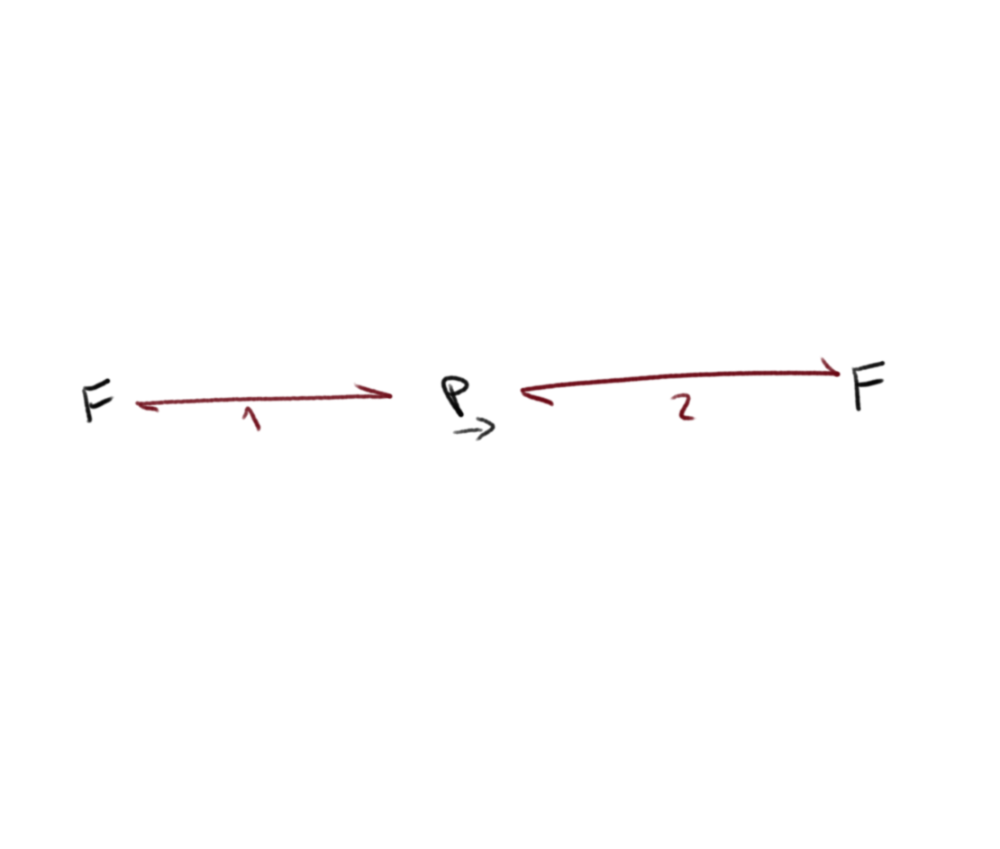
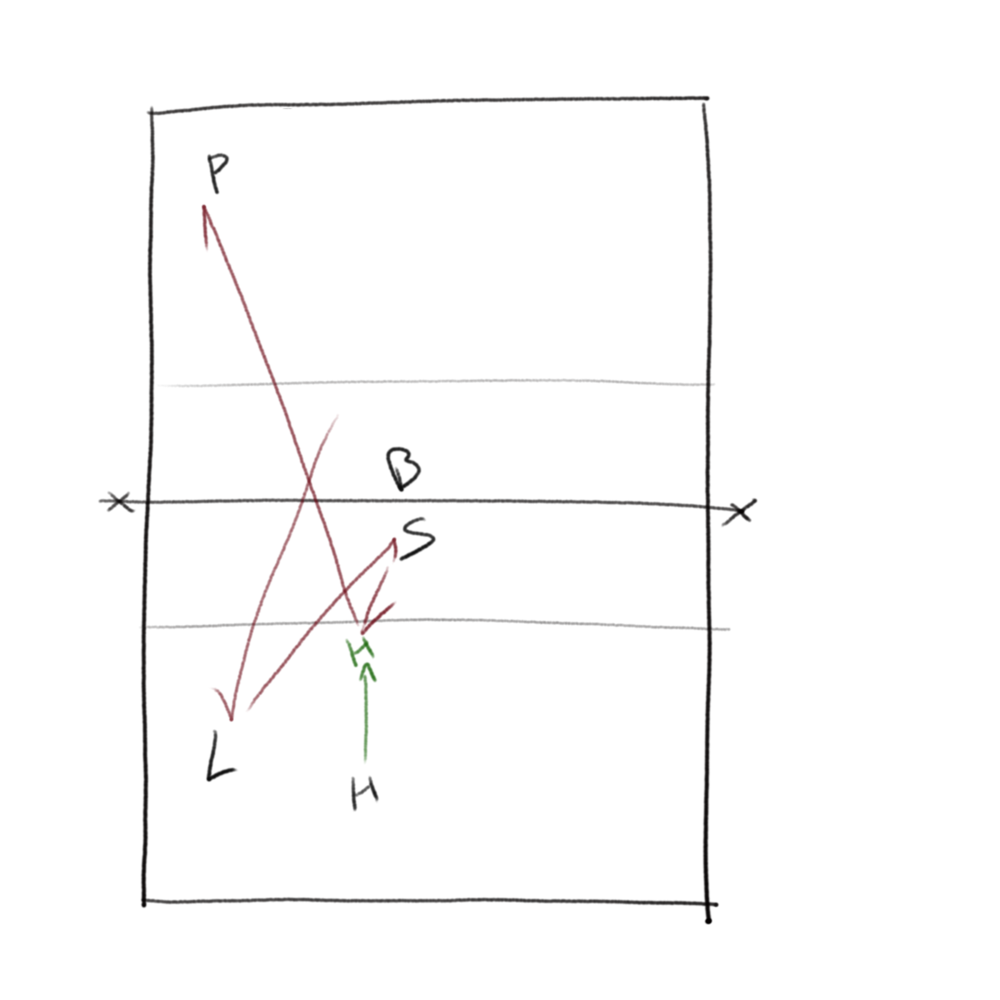
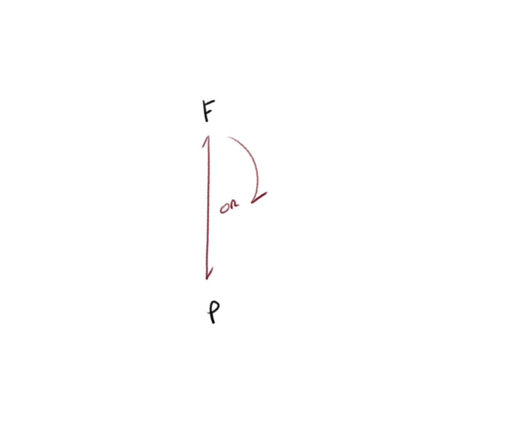
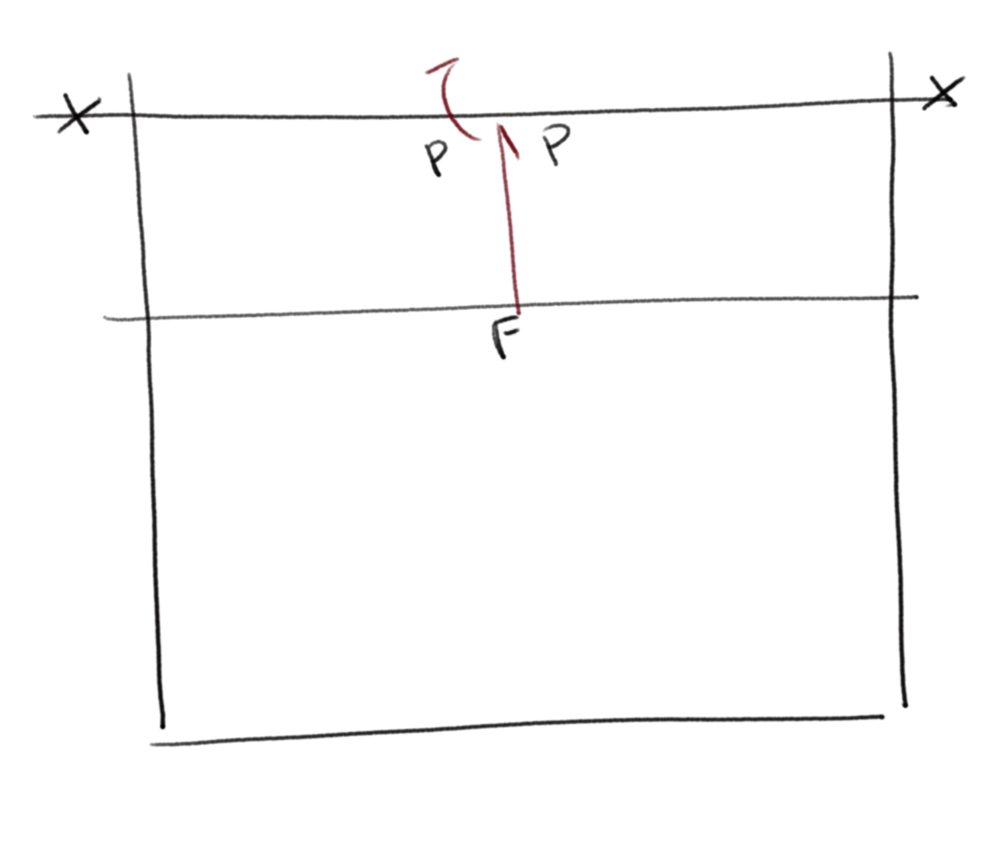

[Index](../../README.md) > [Drills](./../Drills.md)

# Passing Drills

### Middle-Pass-4

`movement`, `position`, `high-energy pass`

<ul style="margin-left: 300px">
  <li>Player starts at 6</li>
  <li>Feeder slaps ball`, `player moves to 1</li>
  <li>Feeder feeds an attack ball and the passer passes to the target</li>
</ul>

 

Adaptations can run any hit at any target with movement from any starting position

---

### Hardball

`high-energy pass`, `interception`, `confidence`

<ul style="margin-left: 300px">
  <li>The feeder hits a series of hard balls at the passer</li>
  <li>The passer has to get the ball in the air</li>
  <li>Focus in intercepting the path of the ball in front of the player and presenting a stable platform</li>
  <li>The other players clear the balls and shout support</li>
</ul>

 

---

### Through-4

`position`

<ul style="margin-left: 300px">
  <li>The feeder is on a bench simulating an attach through 4, with 6 players in base position</li>
  <li>The feeder slaps the ball to trigger movement, and the 6 must move to their defensive positions</li>
  <li>The feeder plays an attack ball and the defenders have to play the ball to the setter (if the setter takes the first ball, they play to whoever the backup setter is)</li>
  <li>The drill then <i>stops</i>; you can run it both sides of the net simultaneously</li>
</ul>

 

Adaptations can run through different attack lanes and teach different defensive positions

---

### Line-Defence

`position`, `high-energy pass`

<ul style="margin-left: 300px">
  <li>Start with just the 3 back-court players in base positions</li>
  <li>The feeder slaps the ball and players move to their defensive positions</li>
  <li>The feeder plays an attack ball and the defenders get the ball back to the feeder</li>
</ul>

 

Adaptations can run through different attack lanes and teach different defensive positions

---

### Double-Dutch

_Taught by Dan Hunter (Team GB libero at London 2012) as used by the men's GB team, who's coach was Dutch (hence the name)_

`reactions`

<ul style="margin-left: 300px">
  <li>Start with each feeder having a ball and the player in the middle, facing away from one of the feeders</li>
  <li>The feeder calls the players name, they turn and immediately get an attack ball</li>
  <li>As soon as they have played the ball, they must turn and face another attack ball from the second feeder
    <ul style="margin-bottom: 0px; list-style-type: circle;">
      <li>The drill then <i>stops</i> and resets.  Some players get stuck in a slow loop of continual turn-pass-turn-pass...  That is not the drill; it should be 2 consecutive, high-speed attack balls with minimal time to react, then we stop and reset.</li>
    </ul>
  </li>
</ul>

 

Adaptations can be to hit the attack feed earlier and earlier (they should at least feed themselves before they call the passer's name), and to through in the occasional tip ball.

---

### Sweaty-Blob

`technique under exhaustion`

<ul style="margin-left: 300px">
  <li>The feeder passes to one of the hitters, who hits a line ball</li>
  <li>The passer moves with the ball to cover the line and passes the attack ball in to the feeder</li>
</ul>

 

Adaptations can involve deception from the feeder to try to get the passer to go the wrong way

---

### Freeball

_Paul Westhead, level 2 coaching course_

`technique`

<ul style="margin-left: 300px">
  <li>Run with 2 balls in each group, and you can run multiple groups over one net</li>
  <li>The feeder gives some sort of feed (whatever you're working on)</li>
  <li>The passer calls and passes to their target</li>
  <li>The target feeds the ball back to the catcher, and they can give feedback to the passer</li>
  <li>The catcher's job is to get the ball to the feeder to keep the drill going</li>
</ul>

 

---

### Freeball-Loop

`technique`

<ul style="margin-left: 300px">
  <li>There is a continuous loop of the passer passing to the target at the net and the target playing a free ball over to the other side</li>
</ul>

 

Adaptations can include the target playing back to the passer to play the free ball over`, `or the target playing a tip over the net

---

### Freeball-Cross

`technique`

<ul style="margin-left: 300px">
  <li>Passer side-steps into position`, `making sure their outside foot is forward so they face back to the centre</li>
  <li>The diagonal feeder feeds a free ball and they pass back</li>
  <li>The passer then sidesteps to the other side and repeats</li>
</ul>

 

---

### Back-Shank

`recovery`

<ul style="margin-left: 300px">
  <li>The feeder throws a high ball out the back of the court</li>
  <li>Some of the players chase down the ball, while others head to cover the centre of the court</li>
  <li>The players get 2 touches to get the ball back over the net</li>
  <li>You can assign whatever responsibilities are suitable for your team, but nobody should be stood watching a ball being chased down</li>
</ul>

 

---

### Side-Shank

`recovery`

<ul style="margin-left: 300px">
  <li>The feeder throws a high ball out the side of the court</li>
  <li>Some of the players chase down the ball, while others head to cover the centre of the court</li>
  <li>The players get 2 touches to get the ball back over the net</li>
  <li>You can assign whatever responsibilities are suitable for your team, but nobody should be stood watching a ball being chased down</li>
</ul>

 

---

### Madman

`extreme defence`, `team-building`

<ul style="margin-left: 300px">
  <li>One player starts in the middle of the court</li>
  <li>The feeder feeds a set number of balls (8-10 is good) to various places in various ways (tip, roll, power etc)</li>
  <li>The player has to touch the ball, forget it and then get on with the next ball</li>
  <li>The other players have two jobs:
    <ul style="margin-bottom: 0px; list-style-type: circle;">
      <li>Collect the balls so the court space is safe</li>
      <li>Vocally support the player</li>
    </ul>
  </li>
</ul>

 

---

### 2-on

`hunger`, `communication`, `responsibility`

<ul style="margin-left: 300px">
  <li>The feeder feeds a free ball over to 2 players</li>
  <li>The players get 3 touches to build an attack</li>
</ul>

 

---

### 3-on

`hunger`, `communication`, `responsibility`

<ul style="margin-left: 300px">
  <li>The feeder feeds a free ball over to 3 players</li>
  <li>The passers pass to a fixed setter (both in the sense that they stay for all rallies, and that they aren't allowed too far from their staring position), then run their hitting lanes</li>
  <li>If the ball doesn't get to the setter then someone else has to set it</li>
</ul>

 

---

### Off-the-Wall

`reactions`, `low`

<ul style="margin-left: 300px">
  <li>The passer is facing a wall with a feeder behind them</li>
  <li>The feeder throws a ball at the wall and the passer has to pass the ball</li>
  <li>Vary the feed for what the passer needs to work on</li>
</ul>

 

---

### Watch-the-Ball

`reactions`, `observation`

<ul style="margin-left: 300px">
  <li>The feeder has two balls and the passer has to stay ready and observant</li>
  <li>The passer has to pass the ball high and back to the feeder</li>
</ul>

 

---

### Under-the-Bar

_https://youtu.be/6SHkijFbpCM?t=208_

`stay low`

<ul style="margin-left: 300px">
  <li>Player starts one side of the bar</li>
  <li>The feeder slaps the ball and the player has to pass under the bar</li>
  <li>The feeder feeds the ball and they pass</li>
  <li>The player is forced to stay lower than they usually want`, `but they usually learn that they have a lot more time</li>
</ul>

 

---

### Pipe-Defence

`matchplay`

<ul style="margin-left: 300px">
  <li>A ball is fed to the libero and 4 hitter at 6, and they pass to the setter</li>
  <li>The setter sets a pipe to the back hitter, who hits at 1</li>
  <li>A blocker is blocking straight to keep the hitter honest</li>
  <li>A passer at 1 has to defend the hit</li>
</ul>

 

---

### Redemption-and-Reward

`psychology`, `determination`

<ul style="margin-left: 300px">
  <li>A passer faces an attack ball at 1 and they pass to the setter</li>
  <li>If the pass is good then they get a free ball to 5, otherwise it's an attack ball cross court</li>
  <li>If they pass the crosscourt ball to the setter then they get a set through 4 that they can hit</li>
</ul>

 

---

### 3-Energies

`passing`, `ball-energy`

<ul style="margin-left: 300px">
  <li>The passer passes three ball sin succession, each of different energies:
    <ul style="margin-bottom: 0px; list-style-type: circle;">
      <li>A tip ball close to 2</li>
      <li>A roll shot at 6</li>
      <li>A power hit cross court</li>
    </ul>
  </li>
</ul>

 

Adaptations can change the order lines and positions of the attacks

---

### Sort-Your-Feet

`footwork`

<ul style="margin-left: 300px">
  <li>The passer faces one of two types of feed:
    <ul style="margin-bottom: 0px; list-style-type: circle;">
      <li>A tip/bump feed (stay on toes and be mobile)</li>
      <li>An attack ball (stable and reactive)</li>
    </ul>
  </li>
  <li>The focus is on sorting your feet first, then playing the ball</li>
</ul>

 

---

### 2-Balls

_Saffi Mant, Solent training_

`work`

<ul style="margin-left: 300px">
  <li>The feeder has 2 balls at once</li>
  <li>The feeder makes the passer move</li>
  <li>If the pass goes wrong, the passer collects it (the feeder just keeps working the other passer; if the feeder collects, the drill stops)</li>
</ul>

 

---

### Within-a-Foot

_Saffi Mant, Solent training_

`work`

<ul style="margin-left: 300px">
  <li>One feeder works three players</li>
  <li>The feeder can feed any passer, but the passers should all work together</li>
  <li>Once the ball is passed, the passers next to the one that passed the ball must touch the passer's shoes</li>
  <li>This forces them to be low and to be close (and therefore supportive) at the point of contact</li>
</ul>

 

---

### Defend From the Bench

_Piotr Wierzchowiec_

`technique`

<ul style="margin-left: 300px">
  <li>The passer starts sat on the bench</li>
  <li>The feeder feeds a loopy feed</li>
  <li>The passer stands up as they pass; they should pass before they're upright!</li>
  <li>Repeat 10 times and swap</li>
</ul>

 

---

### Attack From the Bench

`steep attack`

<ul style="margin-left: 300px">
  <li>The feeder starts on a bench and hits an attack ball at the passer</li>
  <li>The passer stays low and defends the attack; they should learn that staying low buys them more time</li>
</ul>

 

---

### Passing Box Drill

`pass-and-move`

<ul style="margin-left: 300px">
  <li>Start with four groups (in a square) and two balls</li>
  <li>The balls are passed diagonally</li>
  <li>Once the ball is played`, `the passer moves to the next queue</li>
</ul>

 

Adaptations include passing one ball and volleying the other; changing direction on a call from the coach

---

### Random Ball

`ready`

<ul style="margin-left: 300px">
  <li>The feeder hits a ball into a gym ball (from close range)</li>
  <li>The passer has to react and pass the ball</li>
  <li>Note that this can take a bit of time for the feeder to work out how to feed`, `and for the passers to loosen up</li>
</ul>

 

---

### Off the Net

`low and ready`, `out-of-system`

<ul style="margin-left: 300px">
  <li>The feeder drives a ball hard into the net`, `varying the feed point</li>
  <li>Two passers have to get right under the ball and lift it up for their partner to try and hit</li>
</ul>

 

---

### Three Blind Passes

`reaction`

<ul style="margin-left: 300px">
  <li>The passer faces three balls in a row`, `all played off of a hard surface but fed from behind the player</li>
  <li>The passer must react and play the ball up</li>
  <li>This can use a wall or a padded surface</li>
</ul>

 

---

### Hoops Variation

`energy`, `target`

<ul style="margin-left: 300px">
  <li>The passer faces two consecutive feeds
    <ul style="margin-bottom: 0px; list-style-type: circle;">
      <li>An attack ball (stable and reactive)</li>
      <li>A free ball feed (stay on toes and be mobile)</li>
    </ul>
  </li>
  <li>The passer has to try and pass the ball into the hoop</li>
  <li>Can use a scoring system: 1pt for hitting, 3 pts for in the hoop</li>
</ul>

 

---
