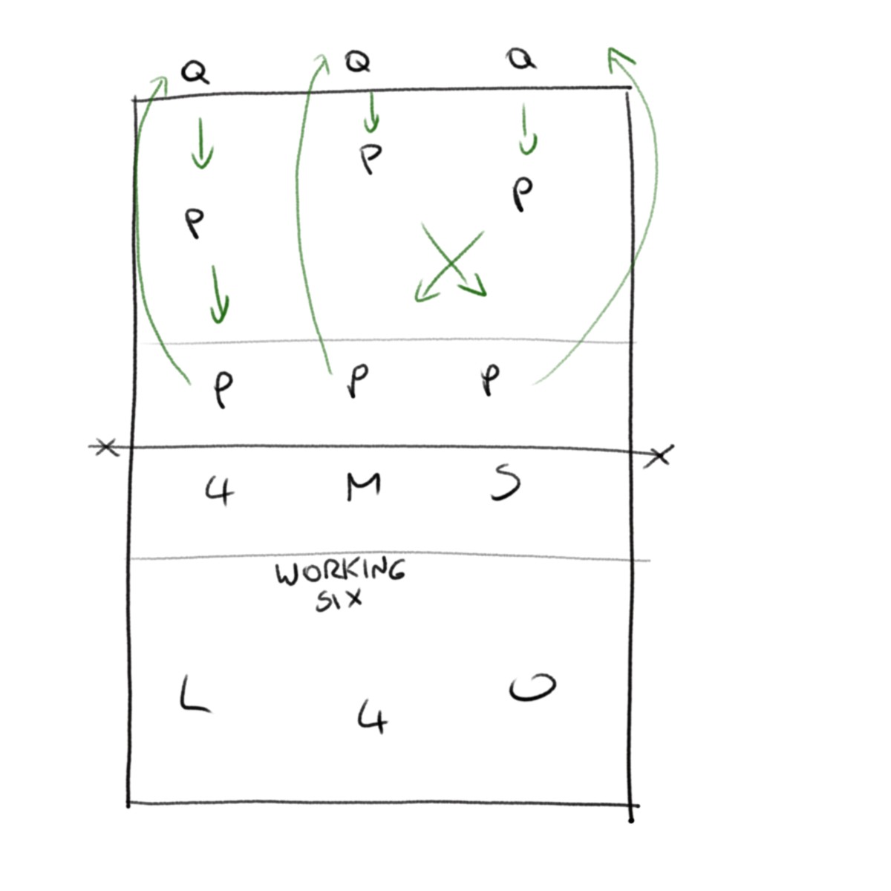

[Index](../../README.md) > [Drills](./../Drills.md)

# Rally Drills

### Warmup Cycle

`warmup`

<ul style="margin-left: 300px">
  <li>Have a setter and two hitters at the net and a couple of passers on back court</li>
  <li>The hitter has to hit at the diagonally-opposite passer</li>
  <li>The passer passes to the setter, and the other passer can back them up</li>
  <li>Can be useful as warm-up for a match</li>
</ul>

 

---

### Korean Receive

_This is what I know as "Korean Receive".  I don't know why it's called that, and other coaches might have something else with the same name_

`warmup`, `defence`

<ul style="margin-left: 300px">
  <li>Have a setter and two hitters at the net</li>
  <li>Three passers cover the back court; they should move to their defensive positions for the relevant hitter</li>
  <li>The passers have as many touches as they need to get the ball to the setter</li>
  <li>When the ball is dead, thee more passers come on, bringing a ball with them</li>
  <li>Note that the hitters <i>need</i> to be told that this is a passing drill and that they should work the passers, not show off how hard they can hit the ball into the floor 1m in front of themselves!</li>
</ul>

 

---

### Six-v-Waves

`rally`

<ul style="margin-left: 300px">
  <li>Put a working 6 on one side of the net</li>
  <li>The driving side have 6 players as well, and always serve</li>
  <li>Play three rallies</li>
  <li>On the driving side, the front row go off, the back row move forwards and a new 3 come on back court (with a ball ready to serve)</li>
</ul>

 

---

### Never Ending Rally

`rally`, `fixing mistakes`

<ul style="margin-left: 300px">
  <li>Play a standard match of 6v6, started from a junk ball</li>
  <li>Whenever there is an error, rewind to the last passer and play it again with the same players playing the same role</li>
  <li>If they make a mistake again, repeat again</li>
  <li>The players get to instantly correct their mistake and find a way to fix the problem</li>
  <li>If the rally had all of the mistakes removed it would never end</li>
</ul>

 

---

### You The Star

`determination`

<ul style="margin-left: 300px">
  <li>This only works with beginners: any experienced team should be putting up a kill every time</li>
  <li>Set up with 6 players on one side and one on the other</li>
  <li>Start from a junk ball played by the lone player</li>
  <li>The 6 have the usual 3 touches, but when the ball comes over, the lone player just has to touch it before it hits the floor</li>
</ul>

 

---

### One-v-One Plus Setter

_Dave Gunter at a Total Volleyball coaching course_

`rally`

<ul style="margin-left: 300px">
  <li>Start with one player each side of the net, with the court half width</li>
  <li>Have a 3rd player as a setter</li>
  <li>Play a rally, but the setter has to run under the net to set on each side</li>
</ul>

 

---

### Two-v-Zero

_Dave Gunter at a Total Volleyball coaching course_

`rally`

<ul style="margin-left: 300px">
  <li>Start with one player each side of the net, with the court half width</li>
  <li>Each player has to run under the net and set for the other player</li>
  <li>Once the player has set, they need to get back to their own side and back to pass</li>
  <li>The setter needs to set high to give themselves time, and the hitter has to find the passer</li>
  <li>This wears players out _really_ fast!</li>
</ul>

 

---

### Three-v-Zero

_Dave Gunter at a Total Volleyball coaching course_

`rally`

<ul style="margin-left: 300px">
  <li>Start with two players one side and one player the other on a court half width</li>
  <li>Feed the ball to the side with 2</li>
  <li>The passer passes to the setter, the setter sets back to the passer who hits over the net</li>
  <li>The passer then runs under the net to become a setter and the setter runs back to become a passer</li>
  <li>The pass, set, hit repeats on the other side of the net</li>
  <li>The sequence for each individual player is then: pass, hit, under the net, set, back off, pass...</li>
  <li>For some reason, this can take players a long time to work out</li>
</ul>

 

---

## Matchplay scoring variations

Each of these is standard matchplay of 6v6 (or however many you have) with variations of scoring systems: if "the game" is the best way of teaching the game, then use scoring variation drills to define the situation.

You can use forfeits for the loser (be that exercise punishment or putting the equipment away), or just the shame of defeat.

Some of these are from the internet, but I don't have a record of where.  If you created the drill then please let me know and I'll add an attribution.

### X before Y
One team has to score "X" points before the other score "Y"

### X in a Row
The winner is the team that scores the highest number of points in a row

### Criterion
Certain "points" are designated as important and the first team to reach that "point" gets a bonus

### Start in the Frying Pan
Start as 12-12, 22-23 etc and not 0-0.  Maybe draw a score from a hat

### Twofer Serve
Each server always serves 2 in a row; no more, no less.  This removes momentum from the game

### Score-flip
At any point, the coach can flip the scores around.  The players can't complain, they just have to get on with it.

### Take a Chance
Every "X" points, the coach pulls a card from a hat with some change on it.  This can be anything, e.g.:
- The team that is down gain 5 points
- Swap the scores
- Swap the 4 hitters
- back court attacks only for the next 10 points

### Final Mountain
You have to score "X" in a row to win the final point

### Weighted Scoring
Score 0 for a free ball, 1 for a down ball, 2 for an attack (all continuous during the rally, or just the winning point), -1 for out/net

### First Ball Kill
The attacking team only score if they kill on the first attack; the defending team can score at any point in the rally.  This incentivises the attacking team to kill quick, but they can still rpevent the other side from getting points by winning the rally.
