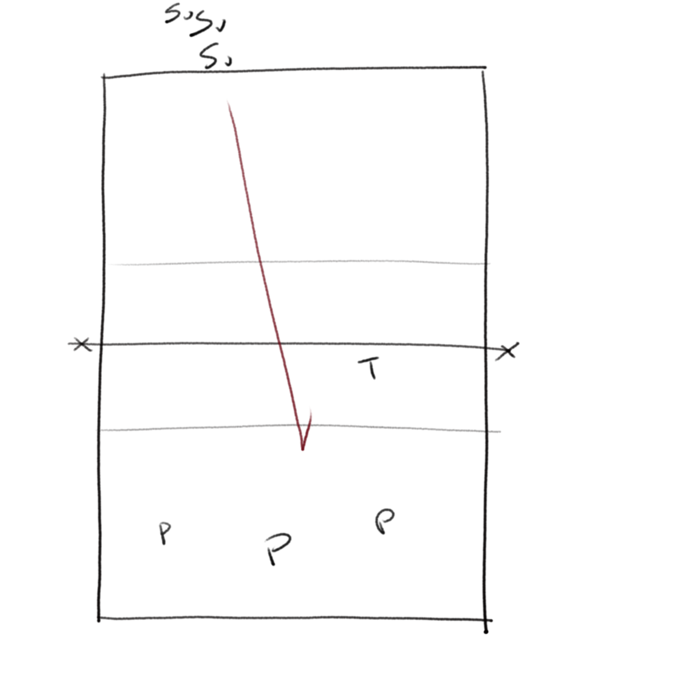
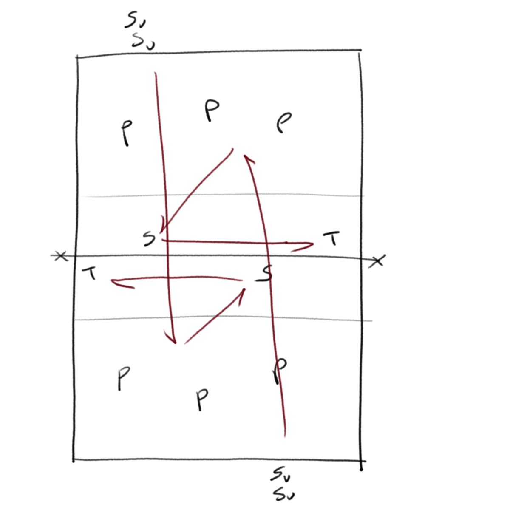
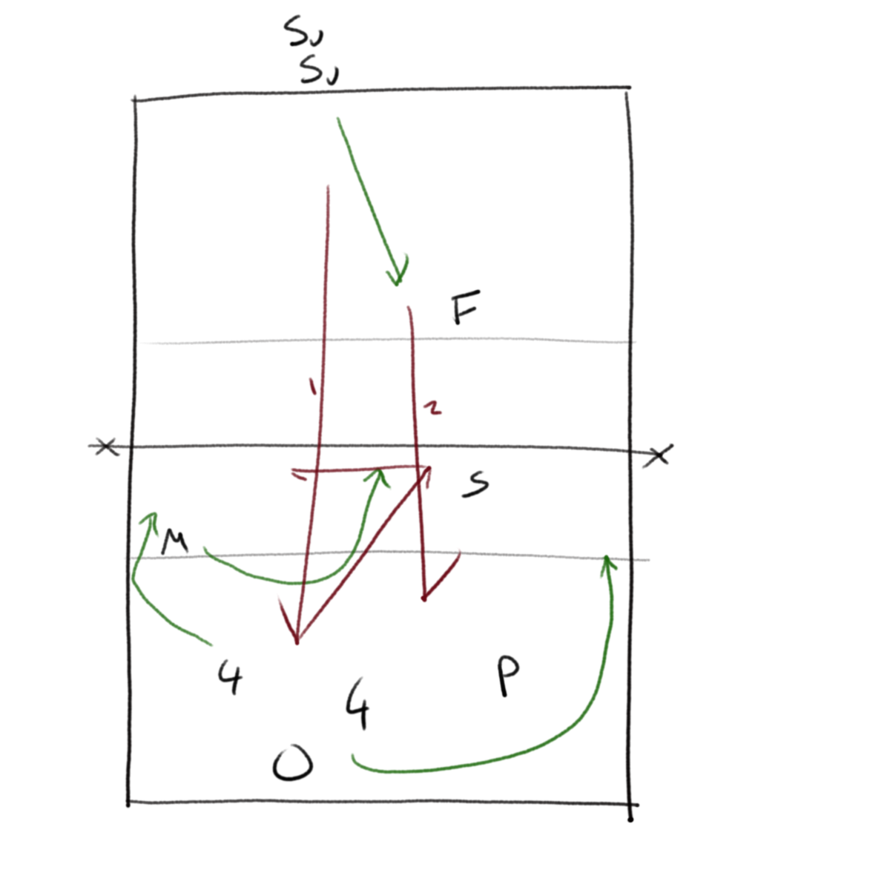
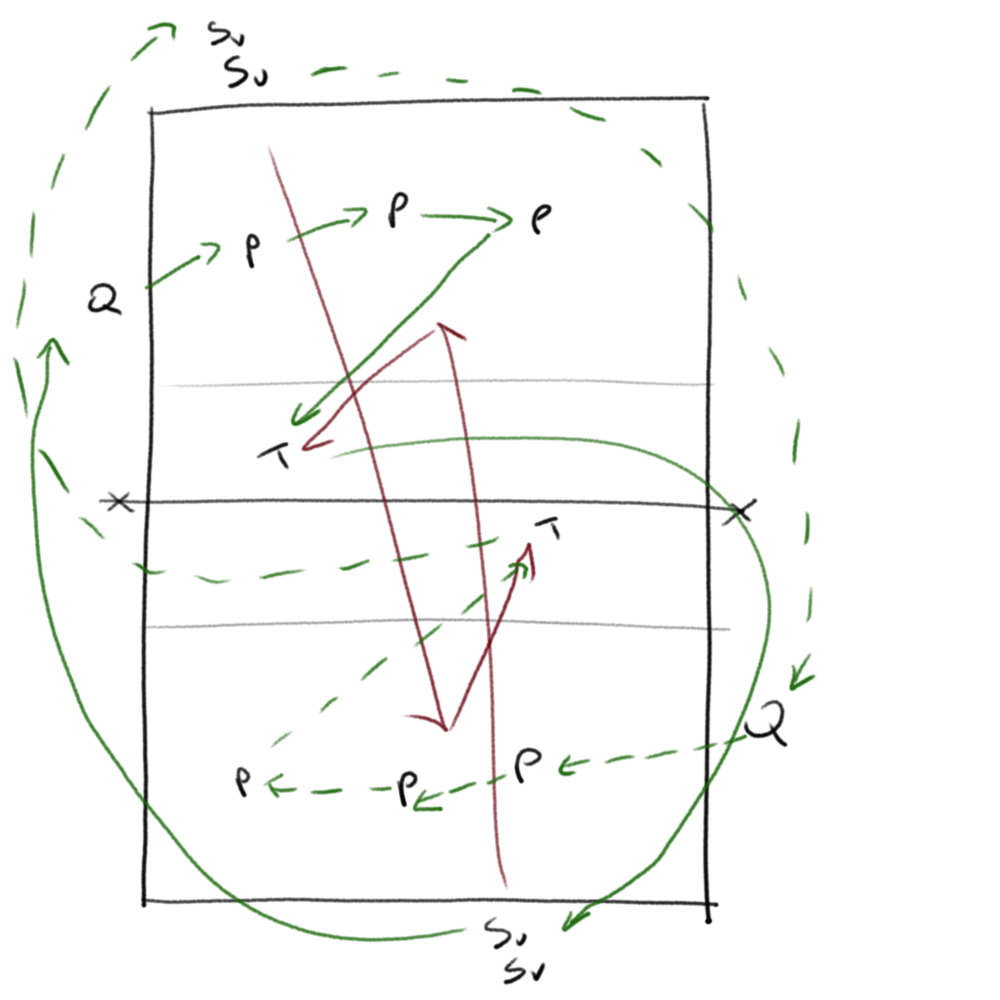
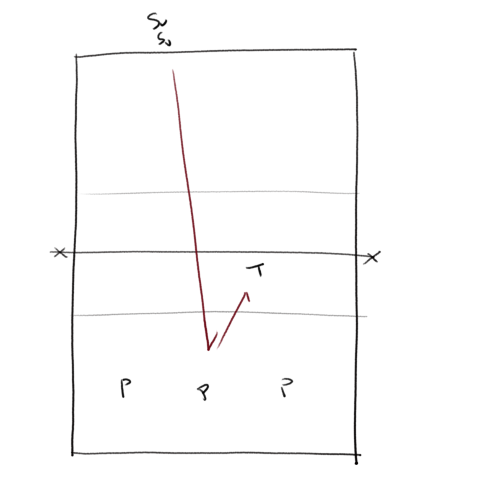
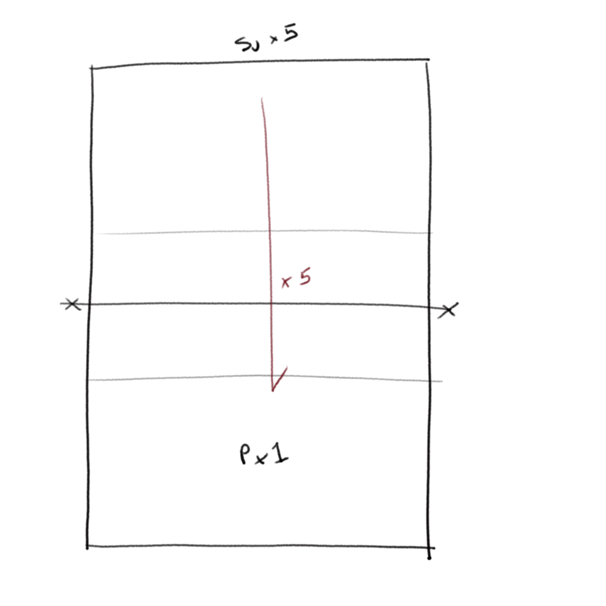

[Index](../../README.md) > [Drills](./../Drills.md)

# Serve Receive Drills

Things to remember for every drill:

1. Defence is a team sport; we pass as a unit, we don't abandon a passer.
2. Ultimately, the ball only knows the contact angle in the 0.05s of contact (_The ball knows angles - Carl McGown https://www.teamusa.org/USA-Volleyball/Features/2011/March/02/STOP-Teaching-Passing_)

### Who am I?

`receive, reacton`

- Split into groups.  Give the servers each a characteristic ("serve long", "5-to-5")
- Passers face a number of serves from each server in turn and they have to guess the characteristics, then react to it by implementing a plan to counter it.

 

---

### Chaos

_Paul Westhead, level 2 coaching course_

`receive, pressue, stats`

- Both sides run at once (multiple balls may be in flight)
- Sv's serve continuously at the receivers (if the passers are ready, the next person serves)
- The receivers pass to the setter, who must set to a target at 4

Adaptations can be that the coach or the setter rates the pass in terms of how many hitting options are open to them

 

---

### Junk Ball

`rally, switching`

- The receiving team start in a standard rotation
- Sv serves a ball over and the receivers build an attack
- Sv then comes on court.  Once the first ball is dead, F feeds a junk ball to Sv, who plays a free ball over the net
- The working team should have switched by now and build an attack from the free ball.  This attack should be aggressive.

 

---

### Panic Button

`allways ready`

- At any point during a training session, the coach can hit the panic button along with calling out a rotation.  The working team must set up their receive in that rotation
- Everyone else goes to the serving line and serve in turn.
- The working team have to play out the rally of each serve.

 

---

### Serve Receive Loop

`receive, pressure`

- Both sides run at once (multiple balls may be in flight)
- SV serves (if the serve goes wrong they must stay and join the back of the serving queue), and then runs round to join Q on the other side of the net
- The passers pass, the target collects the ball.
- The passers move on one position, the left passer becomes the target and the target runs round to the back of the Sv queue

 

---

### Jealous Receive

`receive`

- Sv serves at three passers, who pass to a target at 2
- The target is sat on a chair (eating chocolate)
- If the target can catch the ball then the passer replaces them, they become a server and the server replaces the passer

 

---

### Got the Whole World

`receive, commitment`

- Five servers versus one passer.
- The receiver just has to touch the ball if they can, but must pass if they can.
- Each passer compares their score for their 5 receives

 

---
