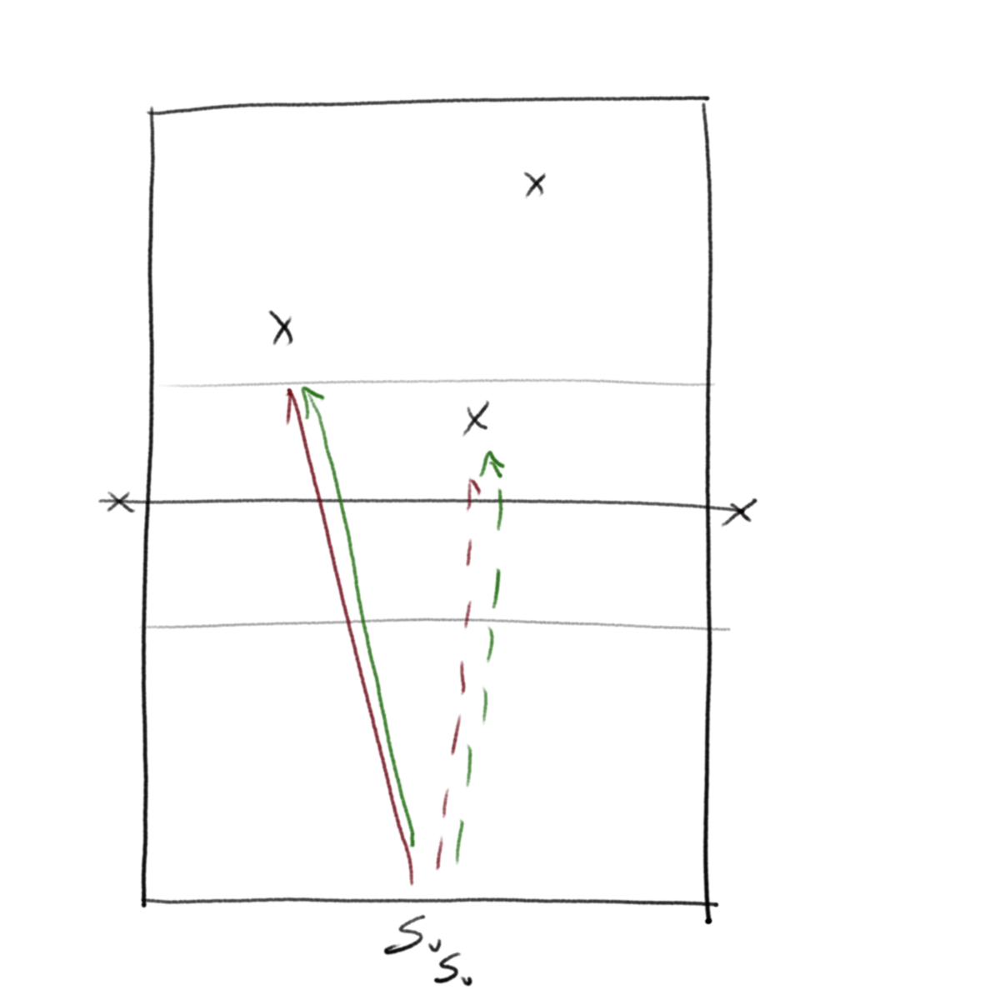
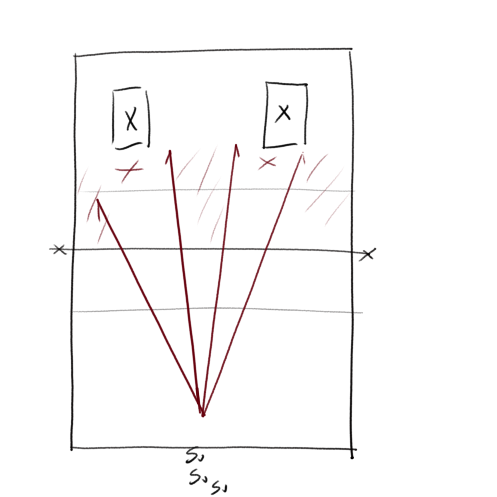
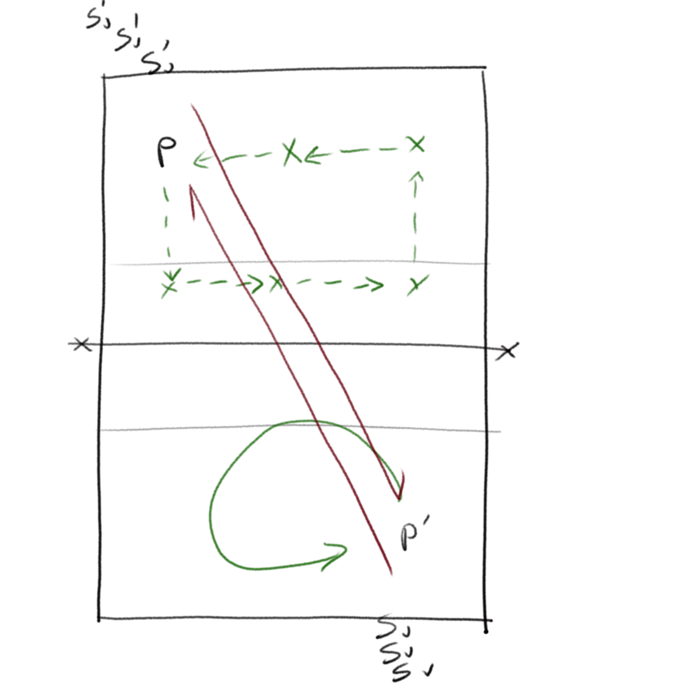
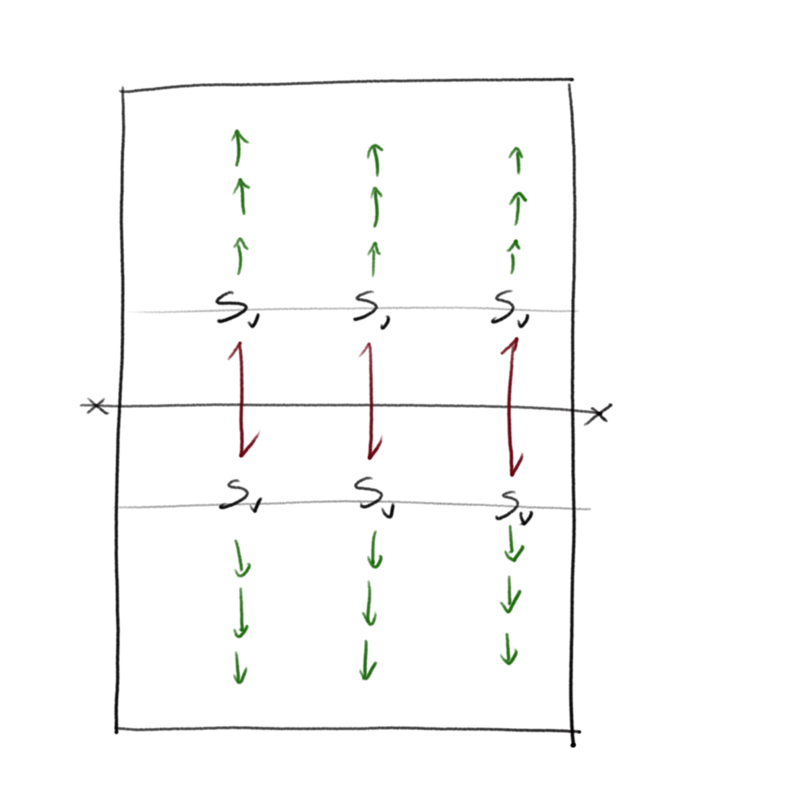
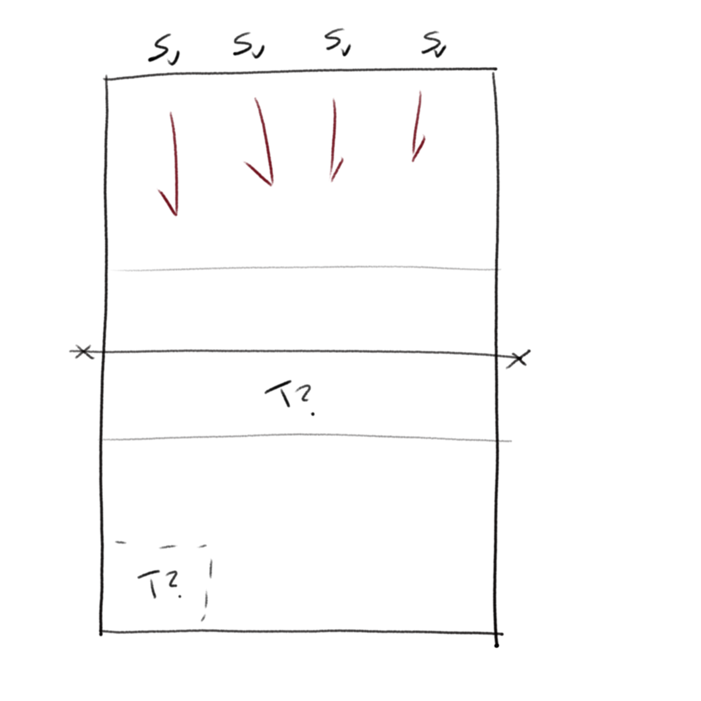
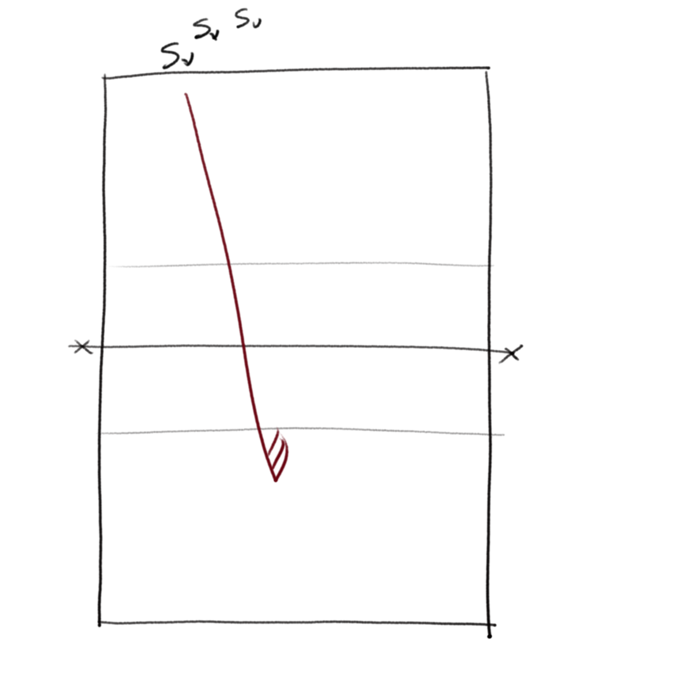
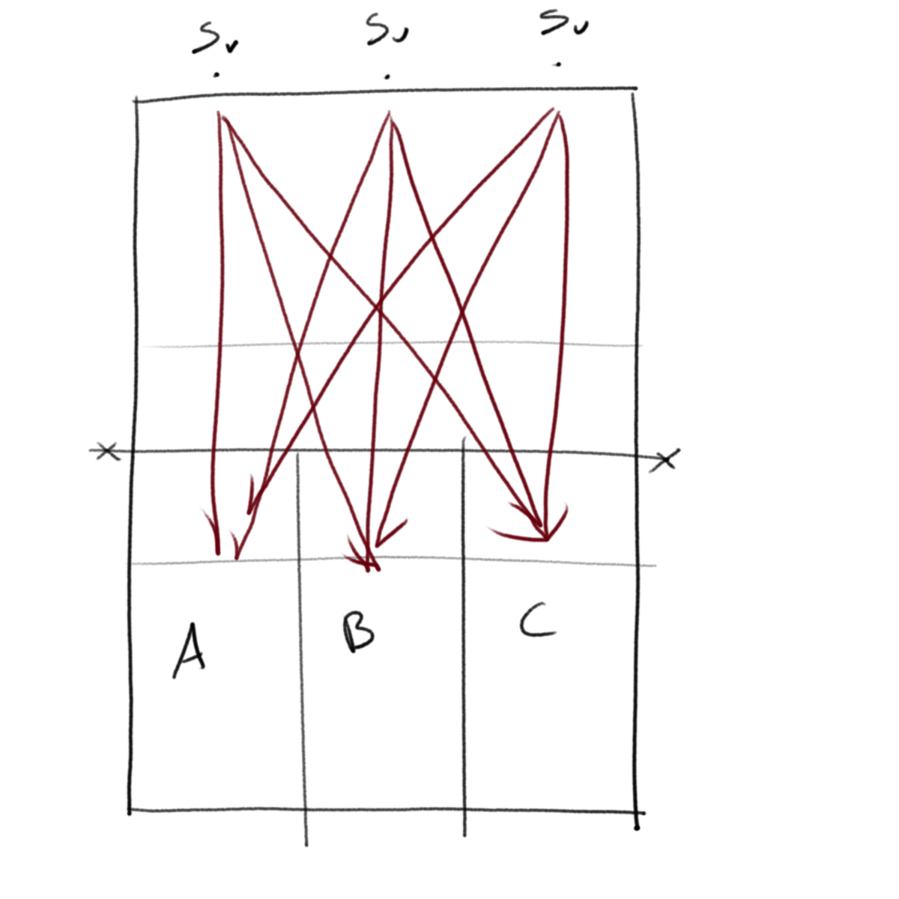

[Index](../../README.md) > [Drills](./../Drills.md)

# Service Drills

### Follow Me

_Paul Westhead, level 2 coaching course_

`accuracy, decision`

- Each player serves in turn
- The player goes and sits wherever the ball lands
- Servers have to avoid the players sat on the floor

Adaptations can be that if the server hits a player then everyone starts again

 

---

### Miss Me

`accuracy, decision`

- Put two mats down on one side of the court with a player on each one.  The players can move, as long as they stay on the mats
- Servers serve in turn and have to serve such that the players on the mats cannot reach the ball

 

---

### Round The World

`accuracy, competition`

- Split into two teams, one on each side of the net
- Each team sends one of their team mates to the other side and they sit in position 1
- The team take turns serving at their team mate.
- If the team mate catches the ball, they come back to their team.  The server then goes to the other side of the net and sits on the floor one position on from the previous catcher
- The teams race to be the first to go all the way round

 

---

### Step Back

_This is an old one but I learned it from Dave Carr at Roke VC_

`skill before power, control`

- Pairs start on the 3m line and serve back and forth
- After 3 successful serves each, both players step back
- Players keep stepping back untilt hey reach the baseline

 

---

### Team Count

`control, consistency`

- Split into two teams of server
- Servers are given a target (maybe serve deep or to a zone).  They get +1 point for hitting the target and -1 point for missing
- Set a scoring target (20 say), and the team keeps serving until they get that target
- Swap the teams over

 

---

### Team Run

`control, consistency`

- Split into two teams of server
- Servers are given a target.  The servers continue to serve for as long as they hit the target
- When the team make a mistake they swap over.  You can keep going round as long as is needed
- The team with the longest run wins

 

---

### Zone Scores

`accuracy, development, statistics`

- Each server serves the same number of serves from each zone to each zone
- Server compares scores to see where they are strong and weak, so know what to improve and want to lean on.

 

---
