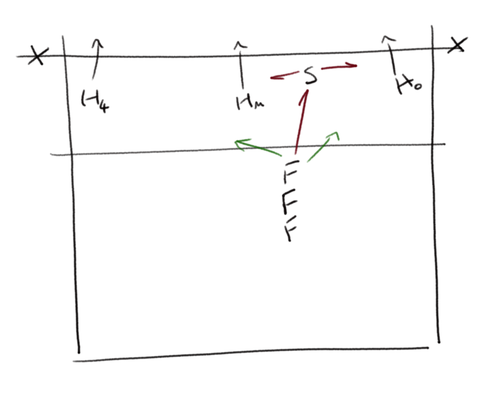
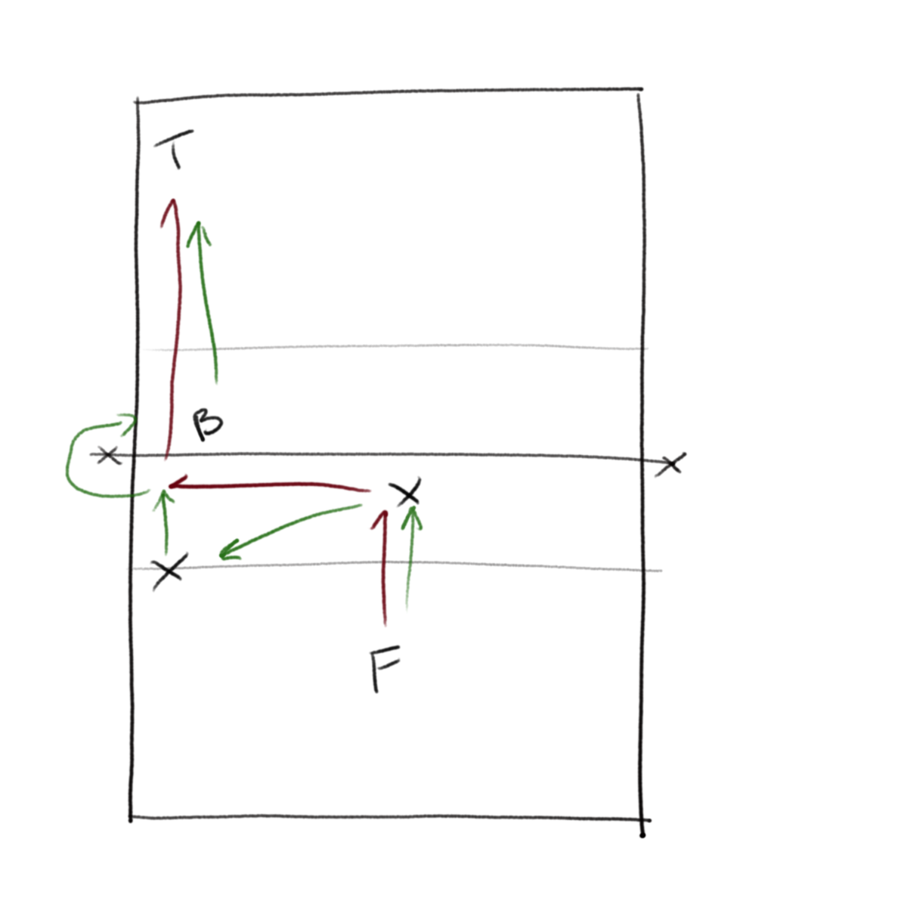
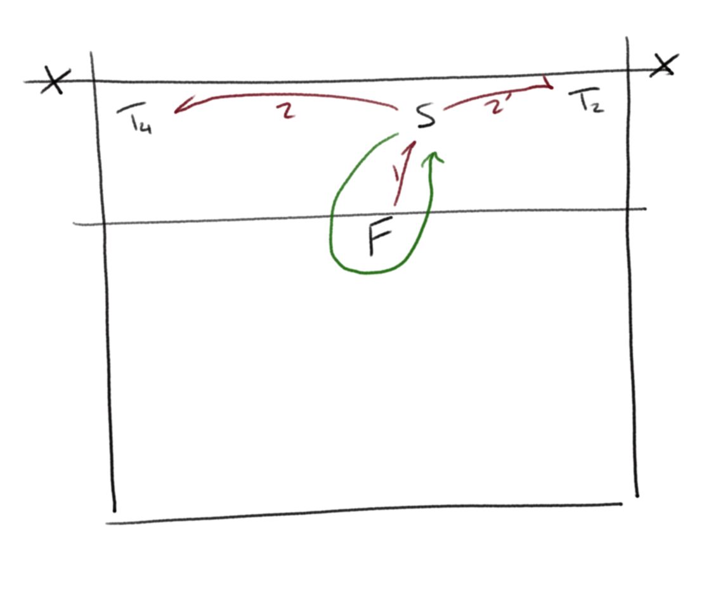
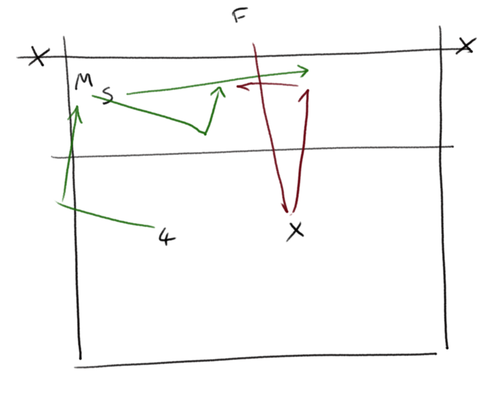

[Index](../README.md) > [Drills](./Drills.md)

# Setter Drills

### Chinese Setter Warmup
`Volleyball England "Setting Session" 2016 https://vimeo.com/170591134`

_movement, setting_

The ball stays in flight throughout the drill with 3 setters working

- S1 starts by feeding to S2, then runs to S3
- S2 back-sets to S3, then runs to S1
- S3 sets to S4, then runs to S2
- S4 plays to S1

Adaptations can include S3 running in to cover tip/attack from S4 (with S4 then playing to S1)

---

### Do As You're Told

_control, variation_

- Setter has 3 front hitting lanes available
- F feeds and calls which lane to set to
- S sets that lane, the hitter hits and collects their ball
- F replaces that hitter

Adaptations can be adding targets for the hitters, or adding blockers

---

### Everybody Sets

_control, confidence, skills_

- F feeds to S, sets to H, hits to target
- B blocks cross and _leaves the line_ for the hitter
- Each person moves on one place

---

### Run Around
`Paul Westhead, level 2 coaching course`

_stamina, control under pressure_

- F feeds to setter
- Setter alternates setting to 2 and 4
- After each set, setter runs around feeder and back to 2 1/2

Adaptations can be to push the setter to awkward positions.

---

### Stacking

_rotations, movement_

- Simulate S/R when stacking
- Setter and middle work on transition
- 4 hitter works on pass, swing out and hit.

---
