[Index](../../README.md) > [Drills](./../Drills.md)

# Setter Drills

### Do As You're Told

`control`, `variation`

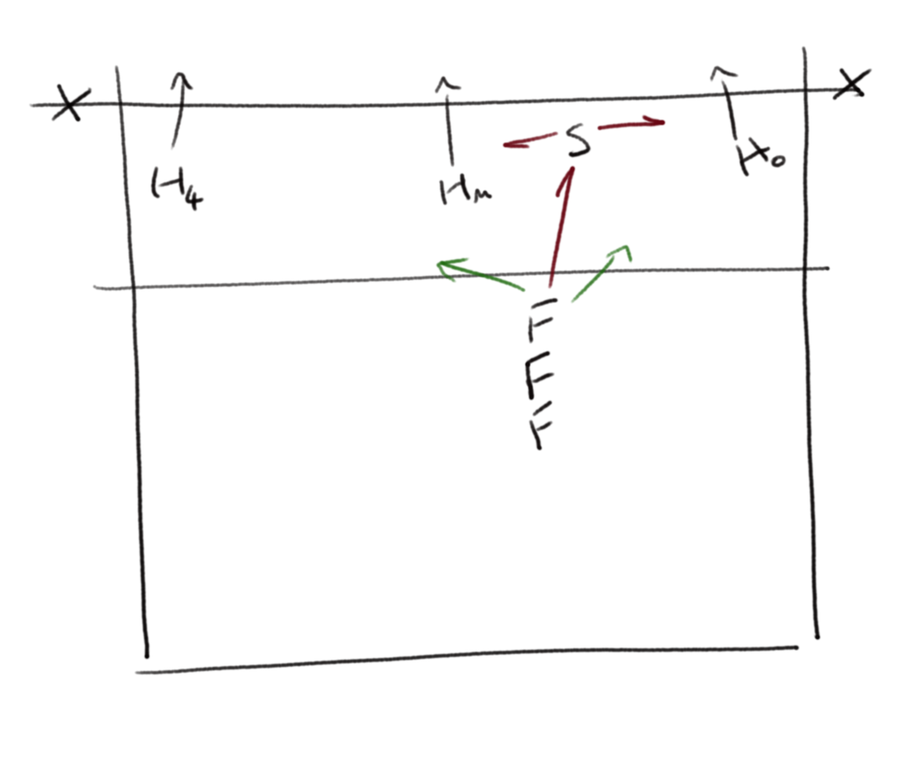

<ul style="margin-left: 300px">
  <li>The setter has 3 front hitting lanes available</li>
  <li>The feeder feeds and calls which lane to set to</li>
  <li>The setter sets that lane, the hitter hits and collects their ball</li>
  <li>The feeder replaces that hitter</li>
</ul>

 

Adaptations can be adding targets for the hitters, or adding blockers

---

### Everybody Sets

`control`, `confidence`, `skills`

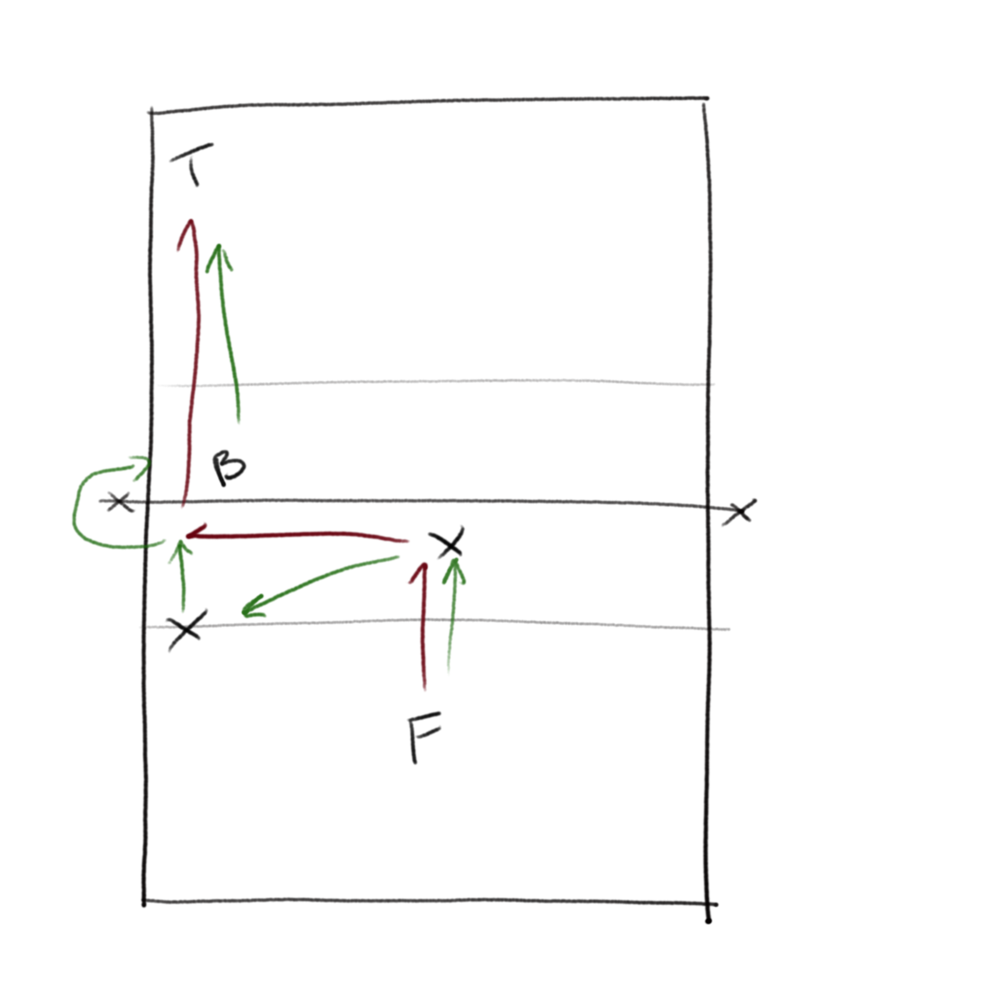

<ul style="margin-left: 300px">
  <li>The feeder feeds to S, sets to H, hits to target</li>
  <li>The blocker blocks cross and <i>leaves the line</i> for the hitter</li>
  <li>Each person moves on one place</li>
</ul>

 

---

### Everybody Sets Well`

`control`, `confidence`, `skills`

<ul style="margin-left: 300px">
  <li>The feeder feeds to the setter, calling the attack</li>
  <li>The setter sets to that position and the hitter attacks</li>
  <li>The setter replaces the hitter, the hitter collects the ball, the feeder joins the setter queue, the hitter is the next feeder</li>
</ul>

Hitters and setters learn what it's like doing each other's jobs

 

---

### Setting triangle

`movement`, `skills`

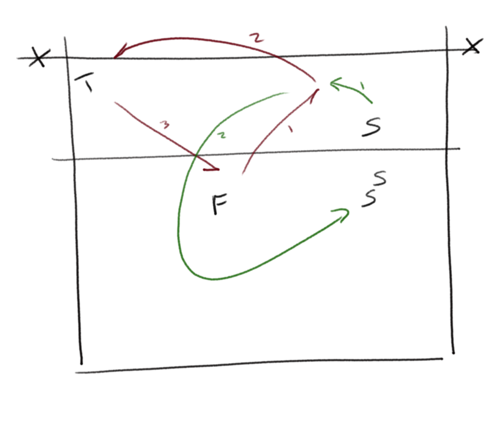

<ul style="margin-left: 300px">
  <li>Feed a ball from mid court, the setter moves in to 2 1/2 and sets to T at 4</li>
  <li>Have a queue of setters at side</li>
  <li>The setter runs through and round the feeder to the back of the queue</li>
  <li>The target returns ball to teh feeder</li>
</ul>

 

---

### Hoops

`control`, `skills`

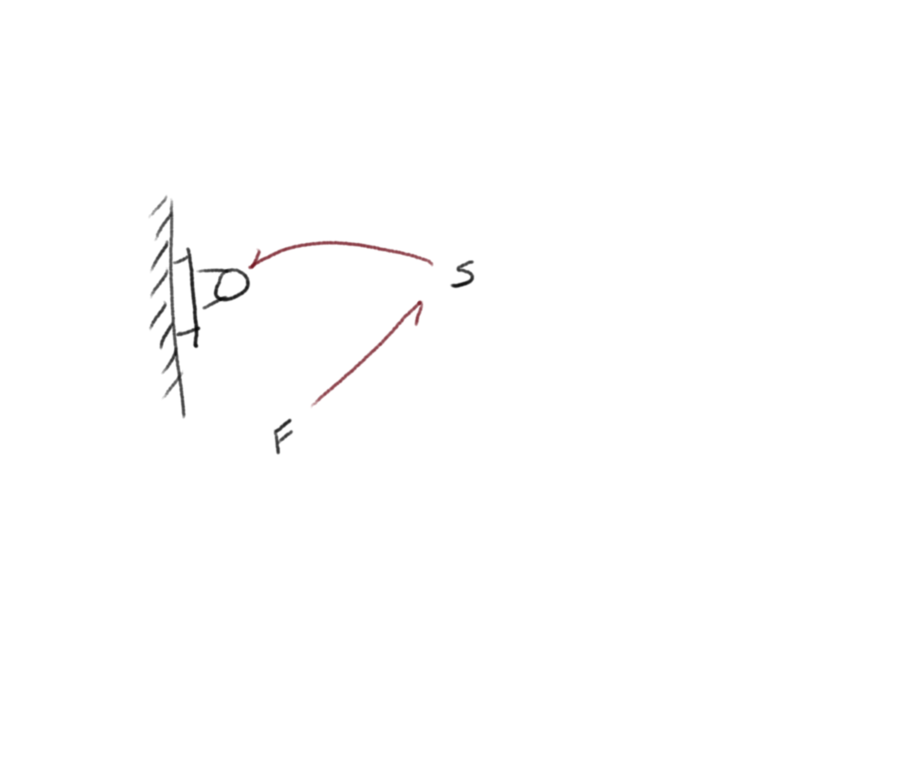

<ul style="margin-left: 300px">
  <li>Use the basketball hoops as a target</li>
  <li>Feed from the left, like a ball in to 2 (could reverse set if feed is from the other side)</li>
  <li>Make the player move</li>
  <li>Use a scoring system: 1 point fort hitting, 3 points for in the hoop.</li>
</ul>

 

---

### Volley Chase

`control`, `skills`

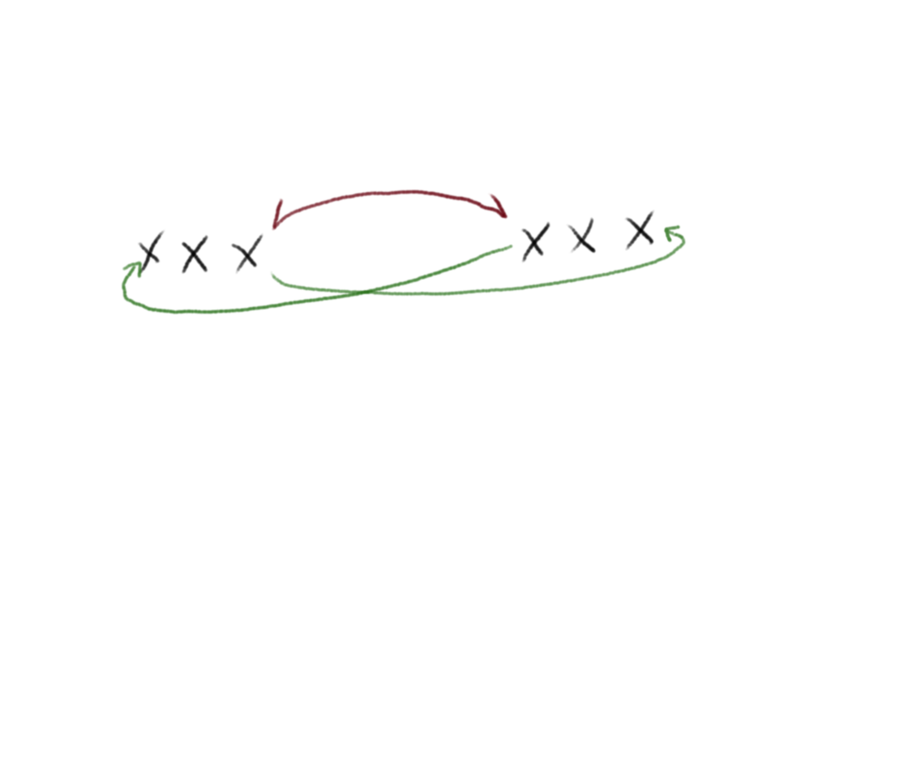

<ul style="margin-left: 300px">
  <li>The ball goes back and forth from queue to queue</li>
  <li>The player volleys then runs to the back of the other queue</li>
</ul>

 

Adaptations can be 2 sets in an X formation crossing each other's paths.

---

### Front Court Chain

`movement`, `defence`

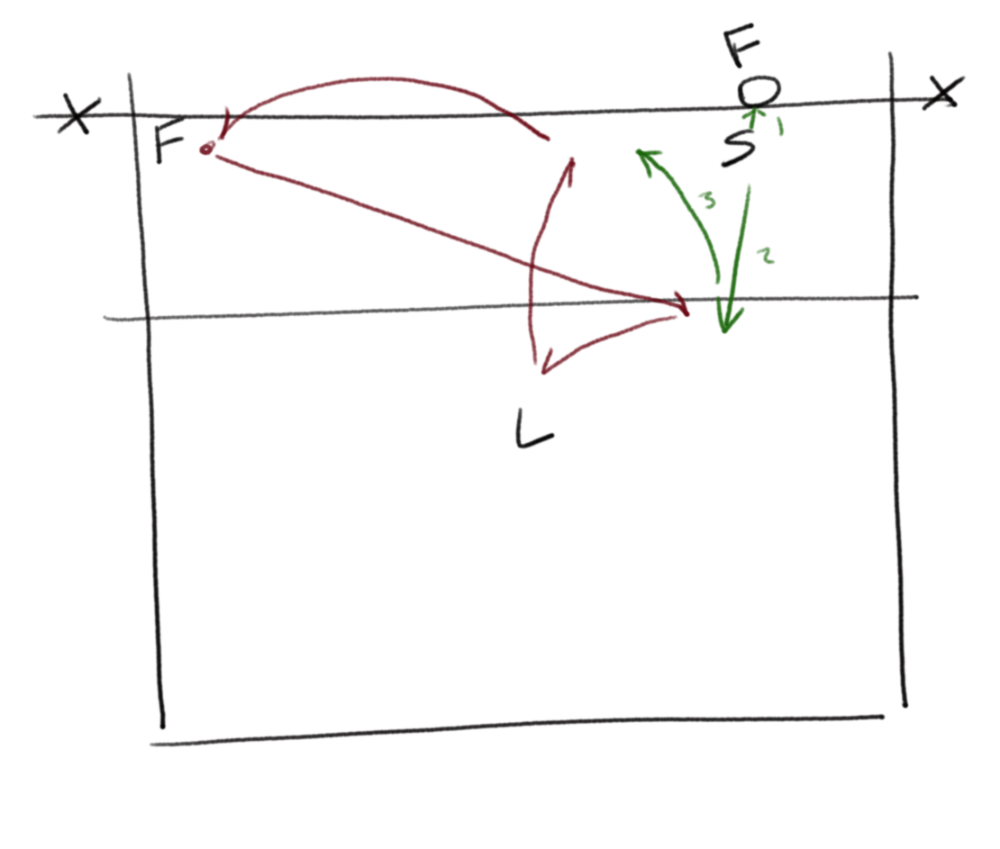

<ul style="margin-left: 300px">
  <li>The setter starts at 2 and block-touches a ball over the net</li>
  <li>Moves back to defend a cross court attack from their opposite</li>
  <li>Pass the attack ball to the centre for the libero</li>
  <li>The libero passes to 2, S moves in and sets to 4 (maybe even covering)</li>
  <li>The setter resets to blocking position</li>
  <li>Repeat until exhausted</li>
</ul>

 

---

### Back Court Chain

`movement`, `defence`

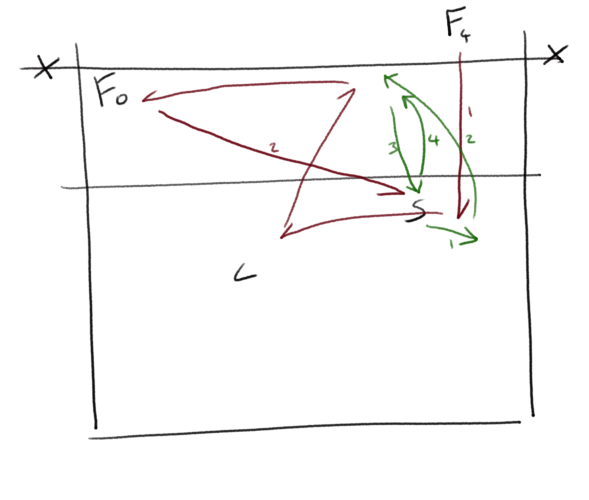

<ul style="margin-left: 300px">
  <li>The setter starts in base position for 1</li>
  <li>Setter moves to defend 4 hit</li>
  <li>F4 hits at the setter, who passes to centre for the libero</li>
  <li>The libero passes to 2 1/2, and the setter runs in and sets 4</li>
  <li>The setter returns to base position</li>
  <li>The setter faces attack from Fo, the setter passes to centre for L</li>
  <li>The libero passes to 2 1/2, the setter runs in and sets 4</li>
  <li>Repeat until exhausted</li>
</ul>

 

---

### Run Around

_Paul Westhead, level 2 coaching course_

`stamina`, `control under pressure`

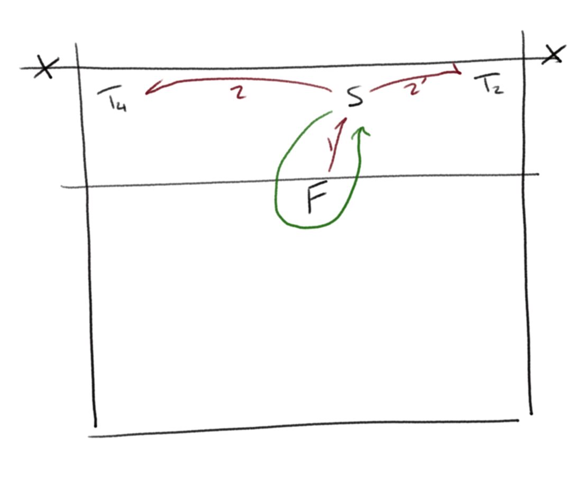

<ul style="margin-left: 300px">
  <li>The feeder feeds to setter</li>
  <li>The setter alternates setting to 2 and 4</li>
  <li>After each set, setter runs around feeder and back to 2 1/2</li>
</ul>

 

Adaptations can be to push the setter to awkward positions.

---

### Stacking

`rotations`, `movement`

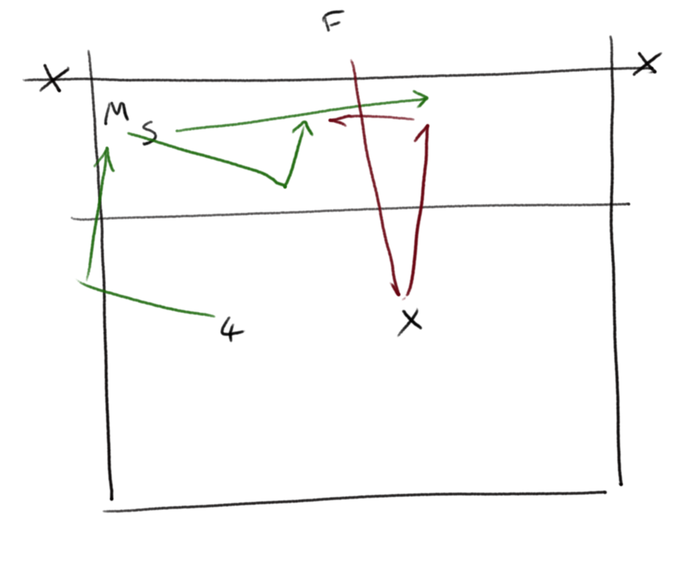

<ul style="margin-left: 300px">
  <li>Simulate S/R when stacking</li>
  <li>Setter and middle work on transition</li>
  <li>4 hitter works on pass, swing out and hit.</li>
</ul>

 

---

### Disguise

`skills`, `disguise`

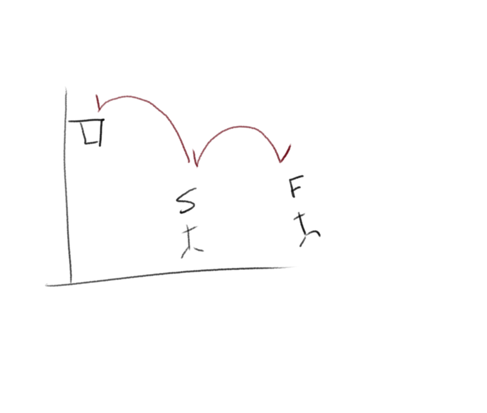

<ul style="margin-left: 300px">
  <li>The feeder feeds the setter then calls "forward or back"</li>
  <li>The setter must set the instructed set</li>
  <li>The feeder calls later and later to challenge the setter; the setter must focus on the same body position each time</li>
</ul>

 

---

### Box Drill

`skills`, `body shape`

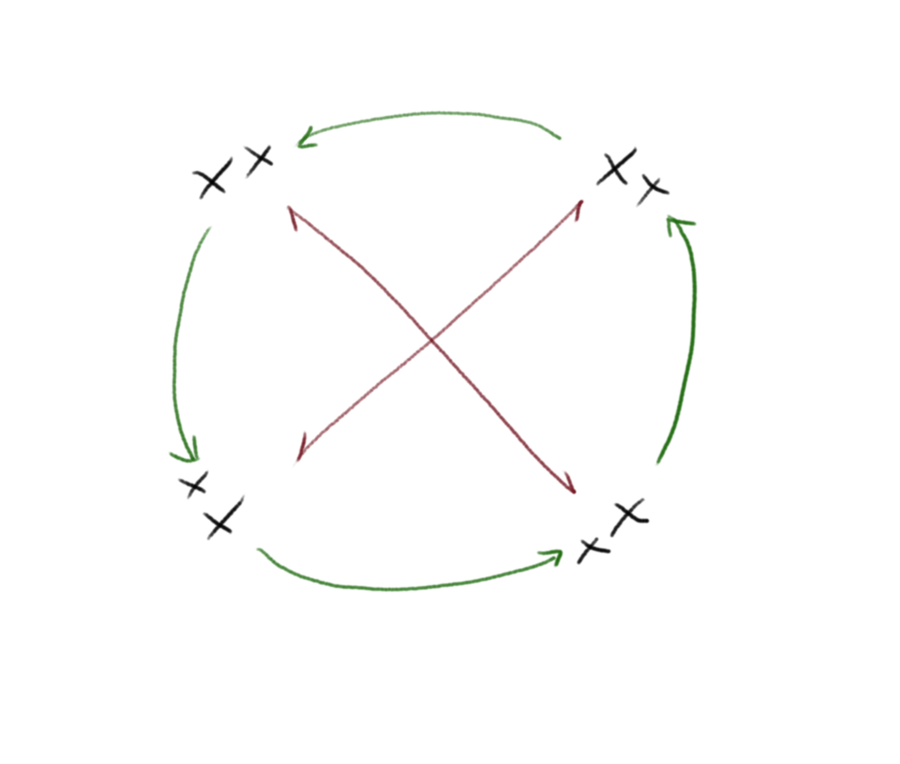

<ul style="margin-left: 300px">
  <li>4 queues in a square, 2 balls in play</li>
  <li>The balls go diagonally from corner to corner</li>
  <li>Once the ball is played, the player moves to the next queue</li>
</ul>

 

Adaptations can be: one ball is passed; change direction

---

### Track Your Hitters

`tactics`

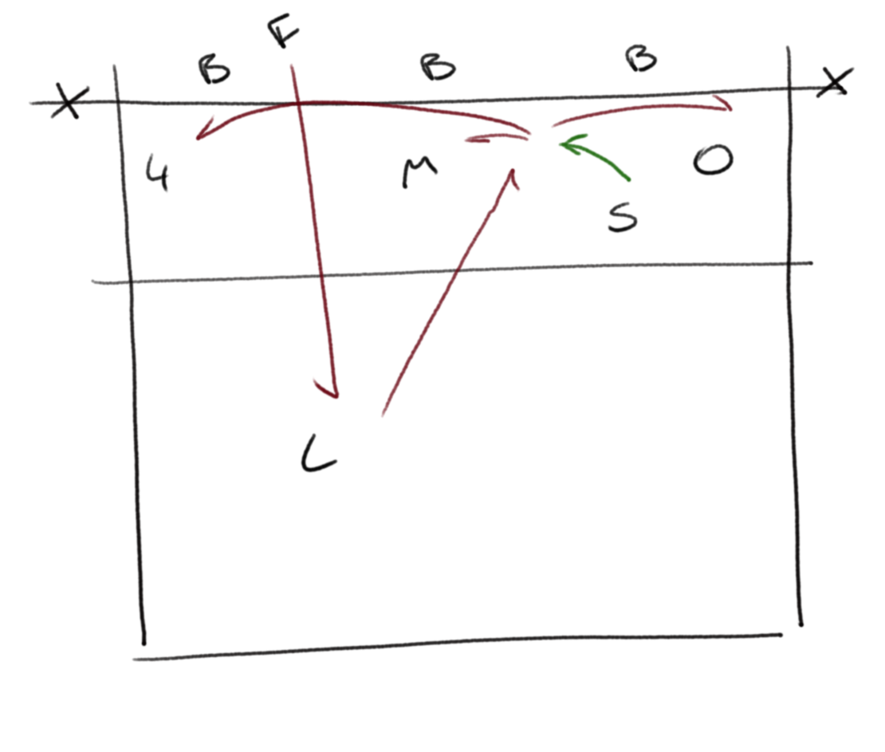

<ul style="margin-left: 300px">
  <li>Free ball to the libero`, `passes to S</li>
  <li>The setter can set any hitter</li>
  <li>The hitter hits ball and then becomes feeder to L</li>
  <li>The setter must track hitters and queues; or hitter can be given specific counts for each hitting lane that they must perform</li>
</ul>

 

---

### Gym Ball

`skills`

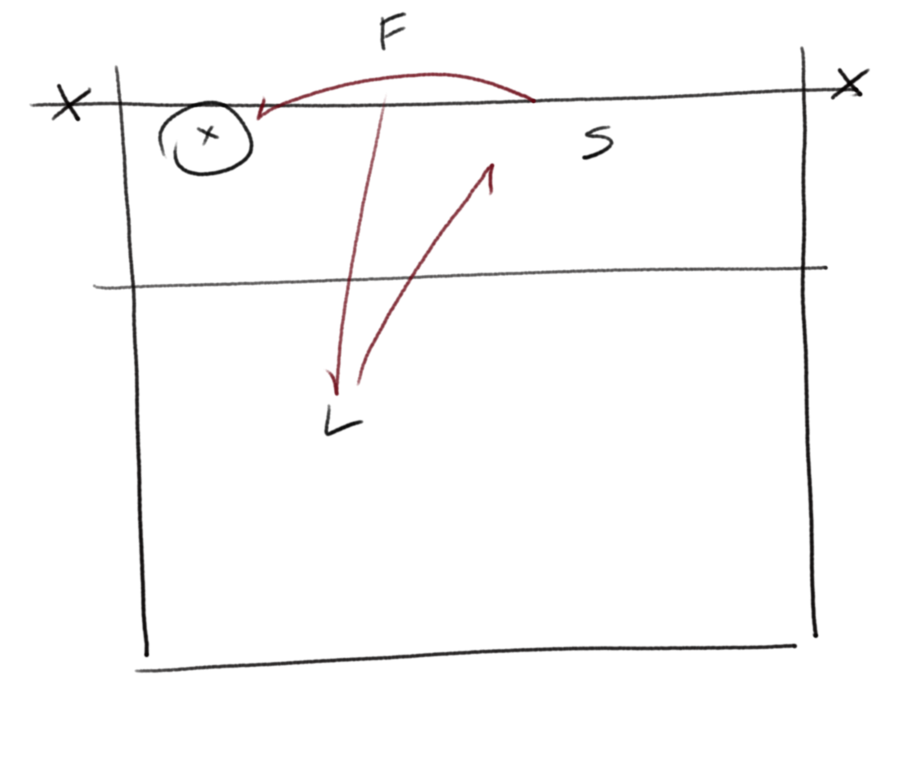

<ul style="margin-left: 300px">
  <li>Someone holds a big gym ball at 4 (or 2/middle lanes)</li>
  <li>The setter receives a feed and must set the ball to the gym ball</li>
  <li>Challenge the setter to set different paces at the target</li>
</ul>

 

---

### Setter Fatigue

_AVCA Video Tip of the Week: Setter Fatigue Drill with Mike Sealy [https://www.youtube.com/watch?v=dnluqw3vghU](https://www.youtube.com/watch?v=dnluqw3vghU)_

`stamina`, `control under pressure`

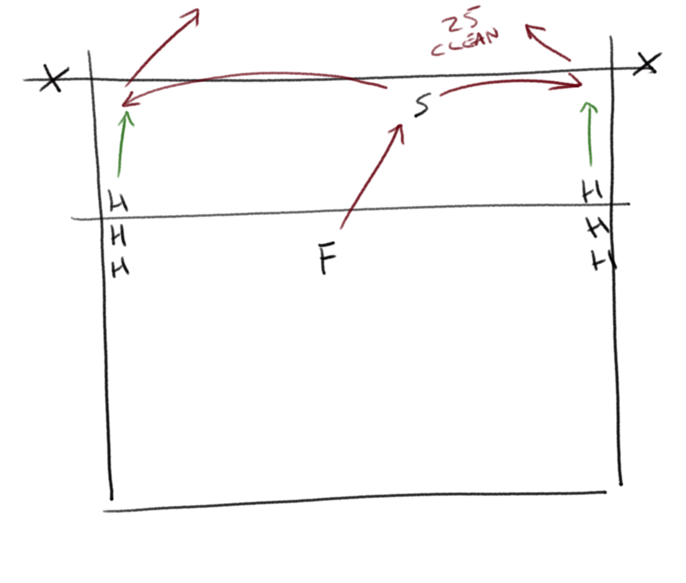

<ul style="margin-left: 300px">
  <li>Setter has hitters through 2 and 4</li>
  <li>Coach feeds balls at a fast pace (next is before the ball is hit) and the setter alternates in front and behind.  The feed can challenge the setter</li>
  <li>Hitters have to hit a clean ball (has to be a hit, and has to clear the net and land in), then collect their ball.  You can give targets as well</li>
  <li>The drill continues until the hitters have hit 25 clean in total</li>
</ul>

 

---
### Chinese Setter Warmup

_Volleyball England "Setting Session" 2016 [https://vimeo.com/170591134](https://vimeo.com/170591134), used by China ladies team at London 2012_

`movement`, `setting`

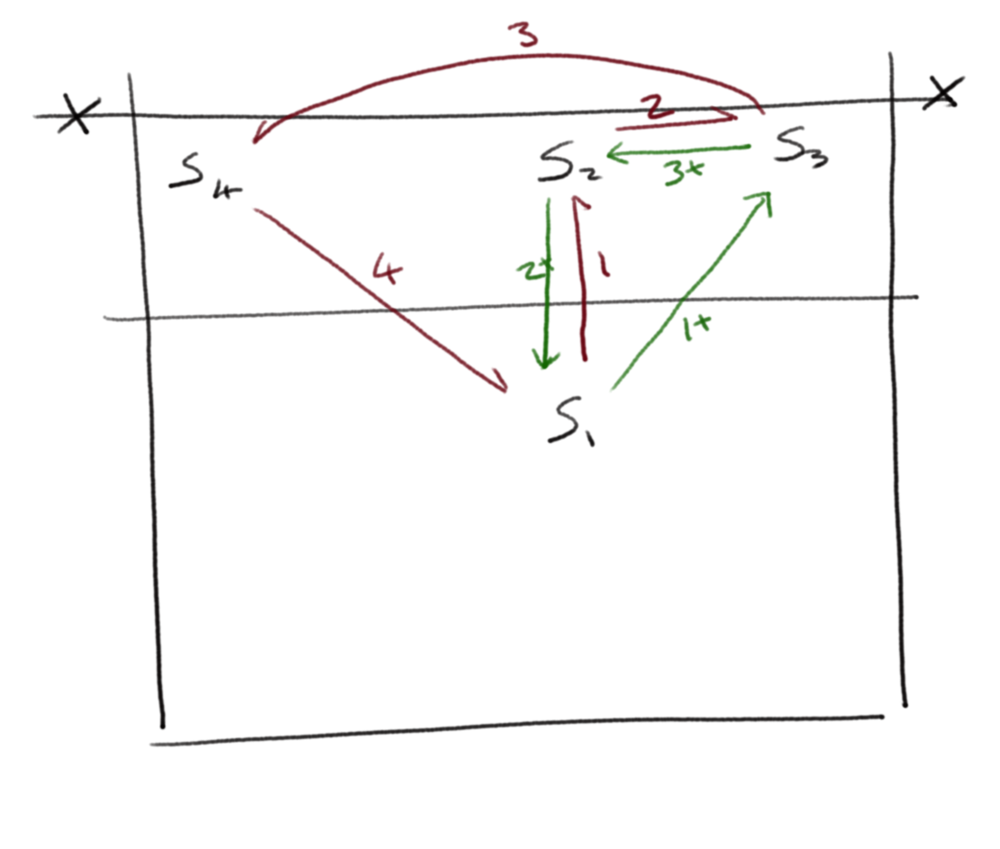

The ball stays in flight throughout the drill with 3 setters working (note that the S# markers on the diagram are positions, not players). One of the setters stays at S4 and the other two setters work around the positions S1 to S3.

<ul style="margin-left: 300px">
  <li>S1 starts by feeding to S2, then runs to S3</li>
  <li>S2 back-sets to S3, then runs to S1</li>
  <li>S3 sets to S4, then runs to S2</li>
  <li>S4 plays to S1</li>
</ul>

 

Adaptations can include S3 running in to cover a tip/attack from S4 (with S4 then playing to S1) before running back to become S2

---
