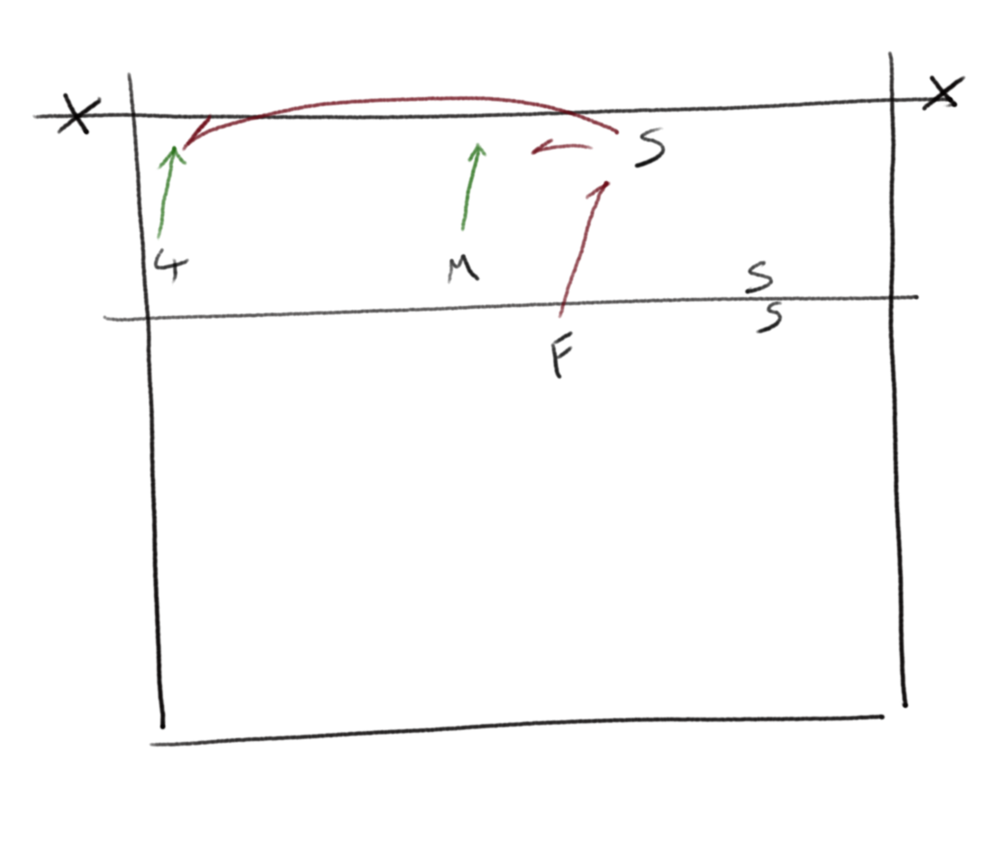

[Index](../../README.md) > [Drills](./../Drills.md)

# Setter Drills

### Do As You're Told

`control, variation`

- Setter has 3 front hitting lanes available
- F feeds and calls which lane to set to
- S sets that lane, the hitter hits and collects their ball
- F replaces that hitter

 

Adaptations can be adding targets for the hitters, or adding blockers

---

### Everybody Sets

`control, confidence, skills`

- F feeds to S, sets to H, hits to target
- B blocks cross and _leaves the line_ for the hitter
- Each person moves on one place

 

---

### Everybody Sets Well`

`control, confidence, skills`

- F feeds to S, calling the attack
- S sets to that position and the hitter attacks
- S replaces the hitter, H collects the ball, F joins the S queue, H is next feeder

Hitters and setters learn what it's like doing each other's jobs

 

---

### Setting triangle

`movement, skills`

- Have a queue of S at side
- Feed a ball from mid court, S moves in to 2 1/2 and sets to T at 4
- S runs through and round F to the back of the queue
- T returns ball to F

 

---

### Hoops

`control, skills`

- Use the basketball hoops as a target
- Feed from the left, like a ball in to 2 (could reverse set if feed is from the other side)
- Make the player move
- Use a scoring system: 1 point fort hitting, 3 points for in the hoop.

 

---

### Volley Chase

`control, skills`

- The ball goes back and forth from queue to queue
- The player volleys then runs to the back of the other queue

 

Adaptations can be 2 sets in an X formation crossing each other's paths.

---

### Front Court Chain

`movement, defence`

- S starts at 2 and block-touches a ball over the net
- Moves back to defend a cross court attack from their opposite
- Pass the attack ball to the centre for the libero
- L passes to 2, S moves in and sets to 4 (maybe even covering)
- S resets to blocking position
- Repeat until exhausted

 

---

### Back Court Chain

`movement, defence`

- S starts in base position for 1
- Setter moves to defend 4 hit
- F4 hits at S, S passes to centre for L
- L passes to 2 1/2, S runs in and sets 4
- S returns to base position
- S faces attack from Fo, S passes to centre for L
- L passes to 2 1/2, S runs in and sets 4
- Repeat until exhausted

 

---

### Run Around
_Paul Westhead, level 2 coaching course_

`stamina, control under pressure`

- F feeds to setter
- Setter alternates setting to 2 and 4
- After each set, setter runs around feeder and back to 2 1/2

 

Adaptations can be to push the setter to awkward positions.

---

### Stacking

`rotations, movement`

- Simulate S/R when stacking
- Setter and middle work on transition
- 4 hitter works on pass, swing out and hit.

 

---

### Disguise

`skills, disguise`

- F feeds S then calls "forward or back"
- S must set the instructed set
- F calls later and later to challenge S; S must focus on the same body position each time

 

---

### Box Drill

`skills, body shape`

- 4 queues in a square, 2 balls in play
- The balls go diagonally from corner to corner
- Once the ball is played, the player moves to the next queue

 

Adaptations can be: one ball is passed; change direction

---

### Track Your Hitters

`tactics`

- Free ball to L, passes to S
- S can set any hitter
- H hits ball and then becomes feeder to L
- S must track hitters and queues; or hitter can be given specific counts for each hitting lane that they  must perform

 

---

### Gym Ball

`skills`

- Someone holds a big gym ball at 4 (or 2/middle lanes)
- S receives a feed and must set the ball to the gym ball
- Challenge the setter to set different paces at the target

 

---

### Chinese Setter Warmup
_Volleyball England "Setting Session" 2016 [https://vimeo.com/170591134](https://vimeo.com/170591134), used by China ladies team at London 2012_

`movement, setting`

The ball stays in flight throughout the drill with 3 setters working

- S1 starts by feeding to S2, then runs to S3
- S2 back-sets to S3, then runs to S1
- S3 sets to S4, then runs to S2
- S4 plays to S1

 

Adaptations can include S3 running in to cover tip/attack from S4 (with S4 then playing to S1)

---
