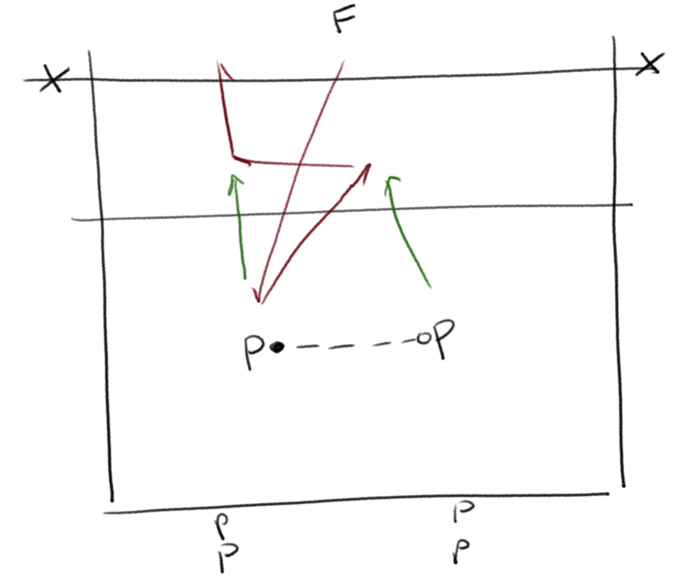
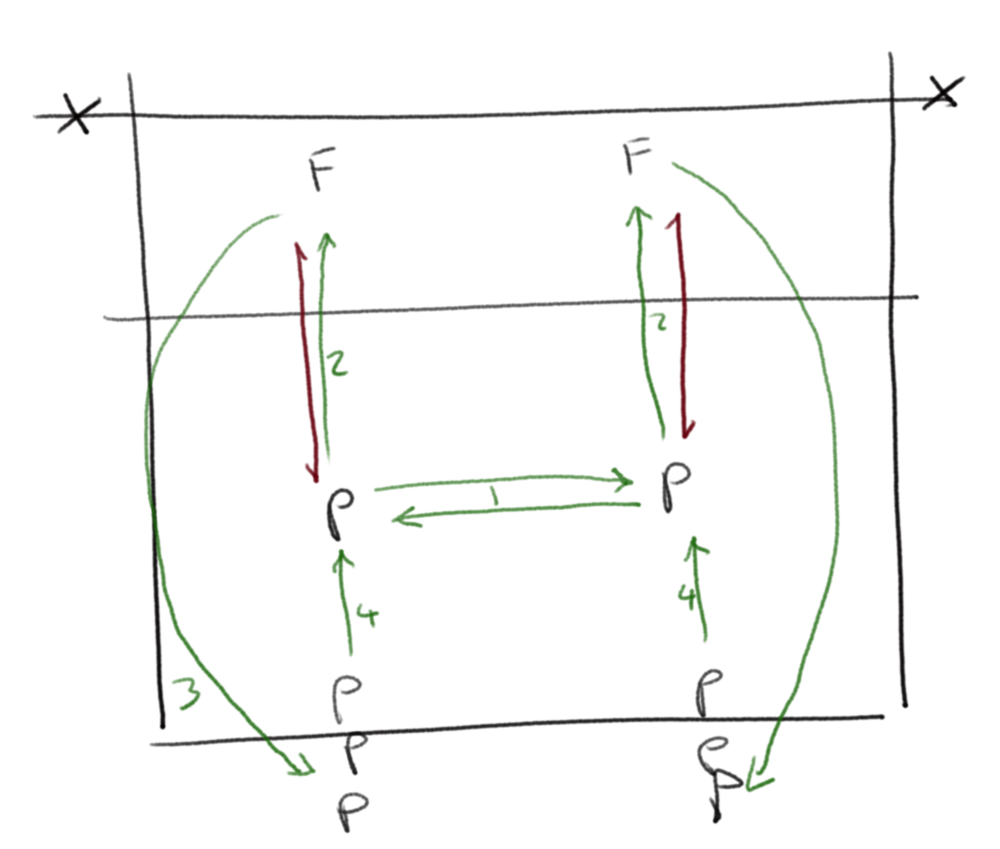
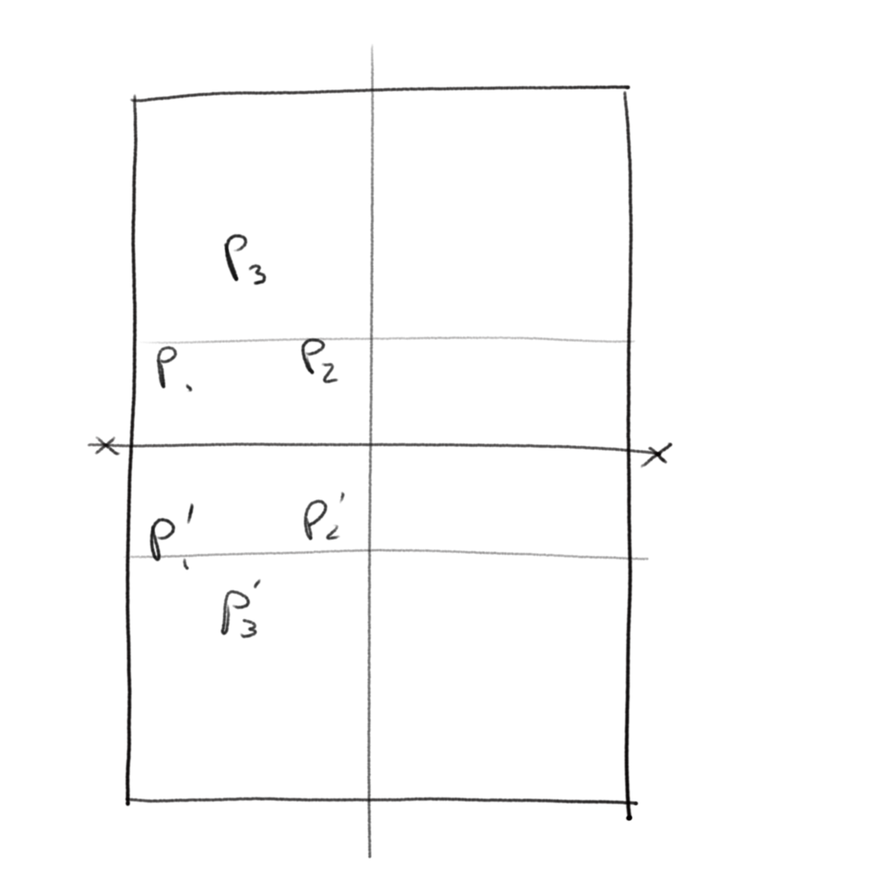

[Index](../../README.md) > [Drills](./../Drills.md)

# Warmup Drills

### Double Ball
_Bertrand Olie - Volleyball England article https://www.volleyballengland.org/news/article/5503/the-coaching-corner_

`thinking`

- The pair have a ball that one of the pair is holding
- F feeds a ball and the pair have 3 touches to build an attack
- The players have to throw the "holding" ball between them before they can play the ball in flight

 

---

### Cross Over
_Saffi Burns, Solent training_

`thinking`

1. Both F feed a ball to their passers; the pair pass the 1st ball, then swap sides
2. Both F feed another ball to their passers; the pair pass the 2nd ball, then run toward F
3. F feed the next players running in, then run away to the back of the queues. The previous P take their place in time to get the first pass from the new pair

 

This can take a while to understand the sequencing; when they do, turn the feed into a volley to make the play continuous.  If that's easy, turn the volley into a roll hit.

---

### Man Marking
_Bertrand Olie - Volleyball England article https://www.volleyballengland.org/news/article/5503/the-coaching-corner_

`thinking, movement`

- Use a small part of the court and play 3v3
- Each player has a "mirror" on the other team
- When a player attacks, their mirror has to pass.  The ball may bounce once before that pass

 

Adaptations can be adding targets for the hitters, or adding blockers

---
