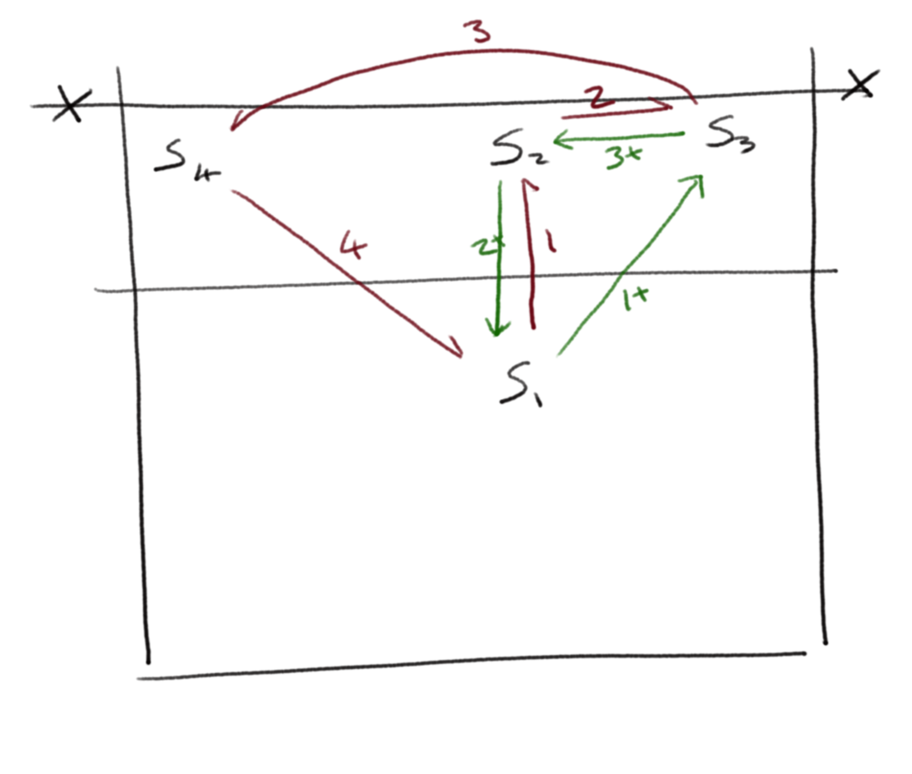

[Index](../../README.md) > [Drills](./../Drills.md)

# Warmup Drills

### Double Ball
_Bertrand Olie , Volleyball England article [https://www.volleyballengland.org/news/article/5503/the-coaching-corner](https://www.volleyballengland.org/news/article/5503/the-coaching-corner)_

`thinking`

<ul style="margin-left: 300px">
  <li>The pair have a ball that one of the pair is holding</li>
  <li>F feeds a ball and the pair have 3 touches to build an attack</li>
  <li>The players have to throw the "holding" ball between them before they can play the ball in flight</li>
</ul>

 

---

### Cross Over

_Saffi Mant, Solent training_

`thinking`

1. Both F feed a ball to their passers; the pair pass the 1st ball, then swap sides
2. Both F feed another ball to their passers; the pair pass the 2nd ball, then run toward F
3. F feed the next players running in, then run away to the back of the queues. The previous P take their place in time to get the first pass from the new pair

 

This can take a while to understand the sequencing; when they do, turn the feed into a volley to make the play continuous.  If that's easy, turn the volley into a roll hit.

---

### Man Marking
_Bertrand Olie, Volleyball England article [https://www.volleyballengland.org/news/article/5503/the-coaching-corner](https://www.volleyballengland.org/news/article/5503/the-coaching-corner)_

`thinking`, `movement`

<ul style="margin-left: 300px">
  <li>Use a small part of the court and play 3v3</li>
  <li>Each player has a "mirror" on the other team</li>
  <li>When a player attacks, their mirror has to pass.  The ball may bounce once before that pass</li>
</ul>

 

Adaptations can be adding targets for the hitters, or adding blockers

---

### Chinese Setter Warmup

_Volleyball England "Setting Session" 2016 [https://vimeo.com/170591134](https://vimeo.com/170591134), used by China ladies team at London 2012_

`movement`, `setting`

The ball stays in flight throughout the drill with 3 setters working (note that the S# markers on the diagram are positions, not players). One of the setters stays at S4 and the other two setters work around the positions S1 to S3.

<ul style="margin-left: 300px">
  <li>S1 starts by feeding to S2, then runs to S3</li>
  <li>S2 back-sets to S3, then runs to S1</li>
  <li>S3 sets to S4, then runs to S2</li>
  <li>S4 plays to S1</li>
</ul>

 

Adaptations can include S3 running in to cover a tip/attack from S4 (with S4 then playing to S1) before running back to become S2

---
