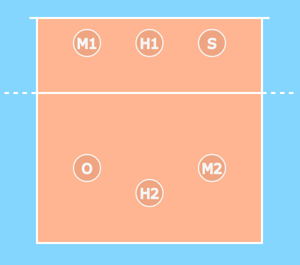

[Index](../README.md) > [Positions](./Positions.md)

# Rotations

## Specialization versus the Rules

We want to allow players to specialise in particular roles within the team so that they can make use of their individual skills, and so that they can focus on being the best
they can at those skills.  The problem is that the roles are linked tightly with the positions on the court (i.e. the setter is at 2 because it's easier for right-handed players
to hit a ball that comes from their right), and the rules place restrictions on where the players must be relative to each other at the start of a rally.  The solution to this is
the rotation system; this is why rotations exist.

The rotation system you use must be suitable for the players in the team.  My aim is to get players to run a 5-1 system, but there's nothing wrong with running a system where
you play the position you're in  and the setter is at set at 3, if that's what is suitable for the players and the environment your playing in.

## Running a 5-1 rotation

Given that the aim is to get to a 5-1 system, I wrote [VBRotations](https://github.com/monkeysppp/VBRotations) to teach new players how the system works and where the players are
supposed to go, from service receive, through to the attack.

You can see the [5-1 rotation system here](https://monkeysppp.github.io/VBRotations)
